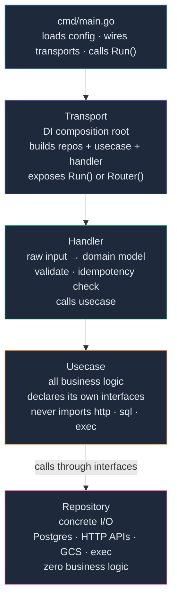
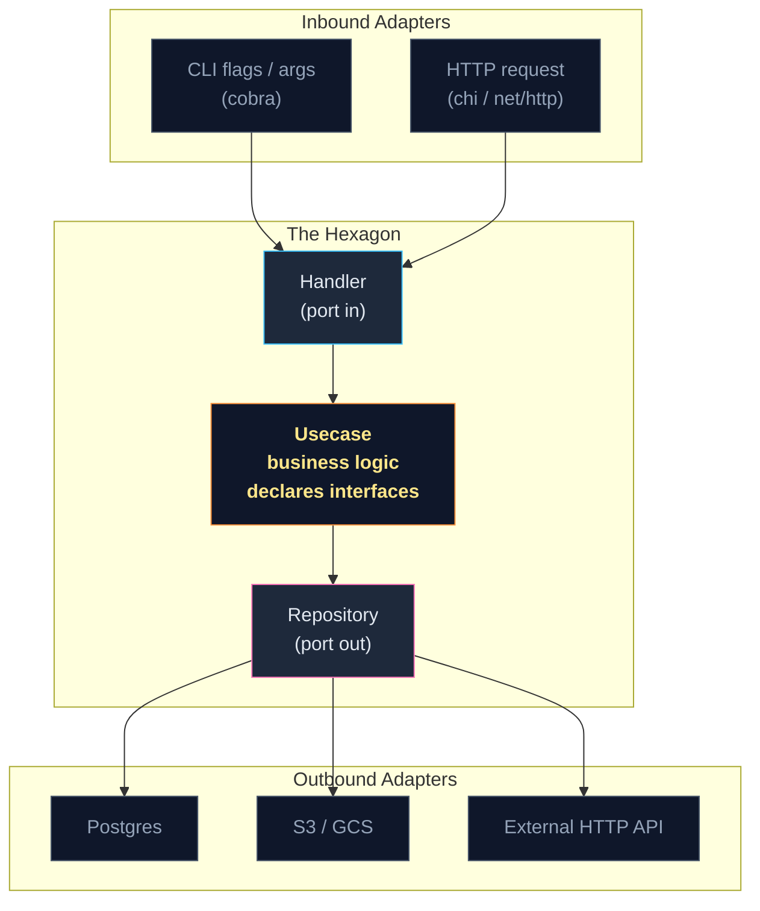
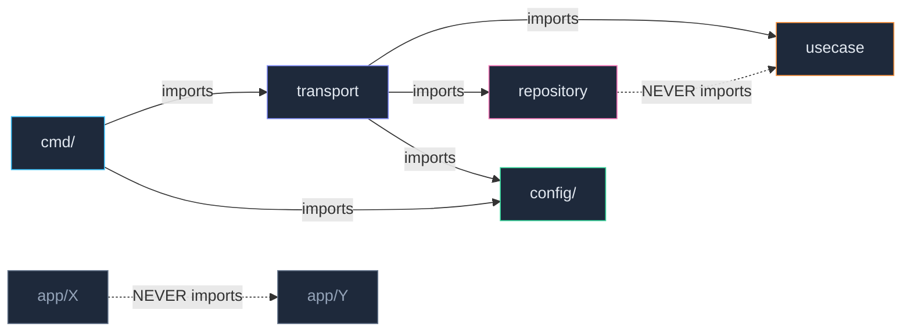

> *In the AI coding era, I spin up a lot of Go projects. Some are experiments, some reach production. Every time I start a new one with a coding agent, I find myself explaining the same structural decisions over and over — in an unstructured, inconsistent way. That friction is what this post is about. The four-layer structure described here is my answer: a lightweight, experience-backed Go project shape that I have not found a better replacement for. This post is the structured version of what I tell every coding agent when starting a Go service — so you can use it the same way.*

---

## Table of Contents

1. [Why Structure Matters in Go Specifically](#1-why-structure-matters-in-go-specifically)
2. [The Four-Layer Model](#2-the-four-layer-model)
3. [Walking Through a Real Component](#3-walking-through-a-real-component)
4. [How to Read This Structure](#4-how-to-read-this-structure)
5. [Real Benefits — Do I Actually See Them?](#5-real-benefits--do-i-actually-see-them)
6. [Lightweight Hexagonal Architecture](#6-lightweight-hexagonal-architecture)
7. [Extension Without Breaking Things](#7-extension-without-breaking-things)
8. [When to Use This (and When Not To)](#8-when-to-use-this-and-when-not-to)
9. [The Import Direction Rule](#9-the-import-direction-rule)
10. [The Take-Away Prompt](#10-the-take-away-prompt)

---

## 1. Why Structure Matters in Go Specifically

Go is intentionally permissive about project layout. Unlike Spring Boot, Django, or Rails, there is no framework that nudges you into a shape. The compiler enforces import cycles and nothing else. Everything beyond that is convention.

This is a feature. It is also a foot-gun.

The permissiveness feels great at the start. You write a `main.go`, add a handler, wire a database connection, ship it. Then you add a second handler. Then a third external dependency. Suddenly you are making a different decision every time you add a file: *where does this validation go? Is this a handler responsibility or a usecase responsibility? Why is my business logic importing `pgx` directly?*

The cost of a bad structure is invisible early and expensive late. It shows up as:

- "I can't test this without spinning up Postgres"
- "I don't know where to add this validation"
- "This PR touched the handler, the database layer, and the config — why?"
- "The new engineer has been reading the codebase for two days and still doesn't know where to look"

But there is a second, more modern reason to care about structure: **coding agents**.

When you work with AI coding assistants on multiple projects, you find yourself repeating the same architectural decisions in an ad-hoc, unstructured way — every new repo, every new session. "Put the business logic here, don't let the handler call the database, declare the interface in the usecase, not the repository..." You say the same things differently every time, and the results vary.

A well-defined structure solves both problems at once. For humans, it creates familiarity and navigability. For agents, it becomes a precise, repeatable scaffold you can hand over in a single prompt. You make the decision once, encode it in a framework, and stop re-explaining it forever.

The Go community has converged on one thing for the outer shell: `cmd/` for entrypoints and `internal/` for private application code. What lives *inside* `internal/` is still up for debate. This post proposes a concrete inner shape — one that is lightweight, familiar once you learn it, and extensible by design.

> **The core idea:** make the decision once. Encode it. Then stop deciding.

---

## 2. The Four-Layer Model

The structure I use is a four-layer model with explicit, non-overlapping responsibilities. It is inspired by hexagonal architecture, but stripped of its jargon and its boilerplate.



Each layer has one job. Here is what it owns, and what it is explicitly forbidden from touching:

| Layer | Owns | Never touches |
|---|---|---|
| `cmd/` | Config load, transport wiring | Business logic, repo imports |
| **Transport** | DI composition, cobra command or HTTP router setup | Business rules, direct I/O |
| **Handler** | Input parsing, validation, idempotency pre-check | Database calls, HTTP clients |
| **Usecase** | All business logic + interface declarations | `http.Request`, SQL drivers, file paths |
| **Repository** | Concrete I/O implementation | Business logic of any kind |

Each component in your service gets its own package with these four files:

```text
internal/app/<component>/
  ├── transport.go    ← DI wiring
  ├── handler.go      ← input normalization + validation
  ├── usecase.go      ← interfaces + business logic
  └── model.go        ← domain types
```

The repository implementations live separately:

```text
internal/repository/
  ├── store/          ← Postgres repos
  ├── httpclient/     ← external HTTP APIs
  └── ...
```

The directory tree is the architecture. You should be able to look at `internal/` and immediately understand how many components exist and what external systems they talk to.

---

## 3. Walking Through a Real Component

Let me make this concrete. Consider an `ingest` component that reads a manifest file, streams audio from a cloud bucket, and records the result in a database.

### Step 1: `cmd/main.go`

```go
func main() {
    cfg   := config.Load()
    infra := repository.NewInfra(cfg) // opens DB pool, HTTP clients — once, here

    ingestT := ingest.NewTransport(cfg, infra)

    root := &cobra.Command{Use: "pipeline"}
    root.AddCommand(ingestT.Command())
    root.Execute()
}
```

`main.go` does three things: load config, build infra, register commands. That is it. It never imports a repository package directly. It never contains business logic. If `main.go` is growing, something is wrong.

The HTTP equivalent is identical in shape:

```go
func main() {
    cfg   := config.Load()
    infra := repository.NewInfra(cfg)

    userT := user.NewTransport(cfg, infra)

    http.ListenAndServe(":8080", userT.Router())
}
```

### Step 2: `ingest/transport.go`

```go
func NewTransport(cfg *config.Config, infra *repository.Infra) *Transport {
    fileRepo   := store.NewFileRepo(infra.Pool)
    gcsClient  := gcsclient.New(cfg.GCSBucket)
    decoder    := audio.NewDecoder(cfg.FFmpegBin)

    uc := ingest.NewUsecase(fileRepo, gcsClient, decoder)
    h  := ingest.NewHandler(uc)

    return &Transport{handler: h}
}

func (t *Transport) Command() *cobra.Command {
    cmd := &cobra.Command{
        Use: "ingest",
        RunE: func(cmd *cobra.Command, args []string) error {
            manifest, _ := cmd.Flags().GetString("manifest")
            return t.handler.Run(cmd.Context(), manifest)
        },
    }
    cmd.Flags().String("manifest", "", "path to manifest file")
    return cmd
}
```

Transport is the only place that knows both the usecase and the concrete repository implementations. This is the composition root — the one place where the wiring lives.

### Step 3: `ingest/handler.go`

```go
func (h *Handler) Run(ctx context.Context, manifestPath string) error {
    if manifestPath == "" {
        return fmt.Errorf("--manifest is required")
    }

    inputs, err := parseManifest(manifestPath) // raw string → []FileInput domain objects
    if err != nil {
        return fmt.Errorf("invalid manifest: %w", err)
    }

    for _, input := range inputs {
        if err := h.usecase.Ingest(ctx, input); err != nil {
            return err
        }
    }
    return nil
}
```

The handler never calls a repository. Its only job is: parse raw input → validate → call usecase. Raw CLI strings and HTTP request bodies never cross into the usecase layer.

### Step 4: `ingest/usecase.go`

```go
// Interfaces declared HERE — satisfied implicitly by repository implementations
type GCSReader interface {
    StreamObject(ctx context.Context, uri string) (io.ReadCloser, error)
}
type AudioDecoder interface {
    DecodeToWAV(ctx context.Context, src, dst string) (durationSec float64, err error)
}
type FileStore interface {
    UpsertFile(ctx context.Context, f File) error
    GetFileByID(ctx context.Context, id string) (*File, error)
}

type Usecase struct {
    files   FileStore
    gcs     GCSReader
    decoder AudioDecoder
}

func (u *Usecase) Ingest(ctx context.Context, input FileInput) error {
    // register → stream from GCS → decode → hash → persist
    // pure business logic — no http.Request, no pgx, no file paths
}
```

This is the most important insight in the whole pattern. **The usecase declares the interfaces it needs, not the repository.** The repository satisfies them implicitly — Go's structural typing means no `implements` keyword, no adapter boilerplate.

### Step 5: `repository/store/file_repo.go`

```go
type FileRepo struct{ pool *pgxpool.Pool }

func (r *FileRepo) UpsertFile(ctx context.Context, f ingest.File) error {
    _, err := r.pool.Exec(ctx, `INSERT INTO files ...`, f.ID, f.Title, f.Hash)
    return err
}
```

`FileRepo` never imports from `app/ingest`. It just happens to implement the methods that `ingest.FileStore` requires. Go's compiler verifies this at the call site in `transport.go` — and nowhere else.

---

## 4. How to Read This Structure

Good structure is documentation. A new engineer should be able to navigate the codebase by following the layers, not by searching for filenames.

### 4a. Onboarding a New Engineer

On day one, you point someone at `internal/` and they immediately see two buckets: `app/` (business components) and `repository/` (infrastructure). Within a component they navigate by question:

| I want to understand... | I look at... |
|---|---|
| What commands / endpoints exist | `cmd/` |
| How a component is wired together | `<component>/transport.go` |
| What inputs are accepted and validated | `<component>/handler.go` |
| What the service *does* (business rules) | `<component>/usecase.go` |
| What interfaces the usecase depends on | Top of `<component>/usecase.go` |
| Where data actually comes from / goes | `repository/` |
| Pure algorithmic logic (no I/O) | `<component>/<algorithm>.go` |

A new engineer doesn't read the whole codebase. They navigate by layer. If they want to understand the chunking algorithm, they open `chunk/usecase.go` and find the logic. If they want to know what Postgres tables are involved, they open `repository/store/chunk_repo.go`. They never need to hold both in their head at the same time.

### 4b. Code Review Perspective

This structure makes code reviews faster because layer violations are immediately visible:

- A PR that modifies `handler.go` should never touch `repository/`. If it does, business logic has leaked into the wrong layer.
- A PR that changes a usecase interface should have a corresponding change in `transport.go` (where the concrete type is passed). If it doesn't, something won't compile.
- A PR that adds a new external dependency should add a new file in `repository/`, a new interface in the relevant `usecase.go`, and a new wiring line in `transport.go`. The change is mechanical and reviewable.
- Import paths serve as a free architecture linter. If you see `internal/repository/store` importing from `internal/app/ingest`, that is visually, immediately wrong — no tooling required.

If a file is growing past 300 lines and it touches both I/O and business logic, the structure tells you to split it. Not as a style preference. As a layer violation.

---

## 5. Real Benefits — Do I Actually See Them?

Architecture claims are easy to make and hard to verify. Here is what I have actually observed using this structure across multiple Go projects.

### ✅ Benefits That Are Real

**Testability without infrastructure.** The usecase declares interfaces. The interfaces can be mocked with a trivial struct. Business logic tests run in milliseconds with no database, no network, no running services. More importantly, I wrote pure-logic files for complex algorithms — chunking boundary detection, QA gating rules, retrieval evaluation metrics — with zero I/O. Those files are tested with `go test ./...` and nothing else. This is not theoretical. It saved hours when iterating on the chunking algorithm.

**New component = familiar scaffold.** When I added a sixth component to the pipeline, I created four predictably named files and one repository file. There was no architecture decision to make, no "where does this go?" conversation. I knew exactly what each file was for before I opened it.

**One struct, N interfaces.** Because Go's interfaces are implicit, a single HTTP client struct passed to four different transports satisfies four different usecase interfaces with zero adapter code. No wrapper, no `Adapter` struct, no code generation. The compiler verifies it at the call site.

**Import violations are self-evident.** A repository package importing from an app package stands out in code review. No linter rule needed.

### ⚠️ Genuine Cons

**Upfront cost.** For a service with one component and one external dependency, this structure is overkill. You are creating four files where one `main.go` would do. The structure pays for itself at the second component, not the first.

**Data mapping overhead.** You map raw inputs to domain types in the handler, and domain types to database rows in the repository. For simple flat structs this is trivial. For complex nested types it becomes tedious. This is the honest tax of keeping layers clean.

**Interface proliferation.** If three usecases all need `GetUserByID`, you declare three interfaces that look nearly identical. This is idiomatic Go — the Go standard library does it everywhere — but it surprises engineers coming from languages where interfaces live in a shared package.

**Transport is an unusual name.** Most architecture literature calls this the "delivery layer" or "adapter." Naming it Transport and having it own dependency injection wiring is deliberate, but it takes some orientation for engineers who know hexagonal architecture from other contexts.

---

## 6. Lightweight Hexagonal Architecture

If you've read about hexagonal architecture (also called Ports and Adapters), this structure will look familiar. If you haven't, I'll explain it without the jargon.

The idea is simple: your business logic should be at the centre, isolated from everything that could change — the database, the HTTP framework, the CLI library. You define *ports* (interfaces) that describe what the business logic needs, and *adapters* (implementations) that plug into those ports from outside.

This structure implements that idea. Here's the direct mapping:



The usecase defines the ports (its interfaces). The handler and repository are the adapters. The transport wires them together.

**What makes this version lightweight:**

- **No shared `interfaces/` package.** Interfaces live in the usecase file that consumes them. The package that *uses* an interface owns it — not the package that implements it.
- **No adapter wrapper structs.** Go's structural typing means your Postgres repo satisfies the `FileStore` interface without declaring `implements FileStore` anywhere. The compiler verifies it.
- **No DI container or code generation.** Transport files are plain Go functions calling plain Go constructors.
- **No framework opinion.** You can use `cobra` for CLI, `chi` or `net/http` for HTTP, or both. The usecase doesn't know either exists.

The result is an architecture that covers the full value of hexagonal design — isolation, testability, replaceability — without its ceremonial cost.

---

## 7. Extension Without Breaking Things

The most practical test of a structure is: *how hard is it to add something new?*

**Adding a new transport type (e.g., HTTP API alongside an existing CLI):**

Create a new `http_transport.go` in the same component package. It builds the same usecase (same constructor, same dependencies) and wires it to an HTTP handler instead of a cobra command. The usecase and repository are completely unchanged.

```go
// ingest/http_transport.go — added later, zero changes to usecase or repo
func NewHTTPTransport(cfg *config.Config, infra *repository.Infra) *HTTPTransport {
    fileRepo  := store.NewFileRepo(infra.Pool)
    gcsClient := gcsclient.New(cfg.GCSBucket)
    decoder   := audio.NewDecoder(cfg.FFmpegBin)

    uc := ingest.NewUsecase(fileRepo, gcsClient, decoder)
    h  := ingest.NewHTTPHandler(uc) // new handler for HTTP, same usecase
    return &HTTPTransport{handler: h}
}
```

**Swapping a database:**

Implement the same usecase interface against the new database. Wire the new implementation in `transport.go`. The usecase file has zero changes, because it only knows about an interface.

**Adding a new component:**

Create a new `internal/app/<component>/` package with the same four files. Add one line to `cmd/main.go` to wire it. Every engineer who has worked on any other component will immediately know how to navigate the new one.

**Adding a new repository dependency to an existing usecase:**

Declare a new interface in `usecase.go`. Add a new field to the usecase struct and constructor. Implement the interface in a repository file. Wire it in `transport.go`. Nothing else changes — and the compiler will tell you exactly what is missing.

Extension in this structure is additive and mechanical. You are filling in a known shape, not making architectural decisions.

---

## 8. When to Use This (and When Not To)

This structure is not always the right answer. Here is an honest guide.

**Use the full four-layer structure when:**
- Your service has ≥ 3 distinct processing components
- It talks to ≥ 2 external systems (a database, an HTTP API, a storage bucket…)
- Multiple engineers will work on it
- You want to unit-test business logic without infrastructure
- You expect to swap or extend infrastructure over time

**Use a simplified variant (collapse transport + handler into `main.go`) when:**
- You have 1-2 components and a clear, stable domain
- The team is one person building a personal tool
- You're in prototype mode and the shape of the domain isn't clear yet

**Write a single `main.go` and revisit when:**
- It's a one-off script with a single purpose
- The entire business logic fits in under 200 lines
- No external dependency is likely to change

**The pragmatic middle ground:** Even on small projects, I now start with at least `cmd/` + `internal/` + a `usecase.go` file. If transport and handler are overkill today, I collapse them into `main.go`. When the second feature arrives, the migration is mechanical — move code, add files, no logic changes. The habit costs nothing and pays off every time a project grows.

---

## 9. The Import Direction Rule

The entire architecture can be expressed as one rule about imports:



Dependencies only flow inward. Outer layers know about inner layers. Inner layers know about nothing outside themselves.

If a repository package imports from an app package, business logic has leaked into infrastructure. If one app component imports from another, you have hidden coupling that will cause a cascade when either changes. If `cmd/main.go` imports a repository package directly, the composition root has leaked out of the transport layer.

These violations are architectural, not stylistic. The fix is to move code, not rename variables. Enforce this rule in code review. No linter required — import paths make violations visually obvious.

---

## 10. The Take-Away Prompt

Everything in this post leads here. If the structure makes sense to you, the next step is applying it to your own service. Here is how.

### Step 1: Answer the Decision Checklist

Before picking a structure, answer these five questions about your service:

- [ ] Does it have ≥ 2 distinct processing components (e.g., ingest + process + export)?
- [ ] Does it talk to ≥ 2 external systems (database, HTTP API, file system, message queue…)?
- [ ] Will more than one engineer work on it?
- [ ] Do you want to unit-test business logic without running infrastructure?
- [ ] Do you expect the infrastructure to change or extend over time?

**Scoring:**
- **4–5 Yes:** Use the full four-layer structure (all four files per component)
- **2–3 Yes:** Use `cmd/` + `internal/` with a `usecase.go` and a flat `repository.go`; introduce the full structure when complexity warrants it
- **0–1 Yes:** Write a single `main.go` and revisit when it grows

### Step 2: Use This Prompt With Your LLM of Choice

Once you have answered the checklist, paste this prompt into your LLM — fill in the bracketed fields for your service:

---

```
You are a senior Go engineer. I am building [brief description of your service].

My service has the following components: [list: e.g. ingest, process, export]
My external dependencies are: [list: e.g. PostgreSQL, S3, an internal HTTP ML API]
My entry point is: [CLI using cobra | HTTP using net/http or chi | both]

Generate a Go project structure using the four-layer pattern with these layers:

  1. cmd/ → thin entrypoint only: load config, construct transports, call Run() or
     register routes. Imports only config and transport packages — nothing else.

  2. Transport → DI composition root per component: construct all repository
     implementations, build the usecase (injecting repos as interfaces), build the
     handler (injecting the usecase), expose a Run(ctx) for CLI or Router() for HTTP.

  3. Handler → data normalization only: unmarshal raw input (HTTP request body /
     CLI flags / file paths) into domain models, validate inputs, check idempotency
     if needed, call the usecase. Never calls repositories directly.

  4. Usecase → business logic: declare its own interfaces at the top of the file
     (the interfaces it needs from the outside world). Implement all business rules.
     Never imports http, sql drivers, os/exec, or any infrastructure package.

  5. Repository → concrete implementations: satisfy usecase interfaces implicitly
     via Go's structural typing. Zero business logic. One file per external system
     per domain concept.

Enforce these rules in the generated code:
  - Interfaces are declared in the usecase file that consumes them, not in a
    shared interfaces/ package.
  - Repository packages never import from app/ packages.
  - App components (e.g. ingest, process) never import from each other.
    Shared domain types go in internal/config/ or internal/model/.
  - cmd/main.go imports only config/ and transport packages.

For each component, generate:
  - transport.go  (DI wiring + cobra command or HTTP router)
  - handler.go    (input normalization + validation + usecase call)
  - usecase.go    (interface declarations + business logic skeleton)
  - model.go      (domain types for this component)

For each external dependency, generate a repository implementation file
in internal/repository/<system>/.

Also generate:
  - The full internal/ directory tree with a one-line comment on each file's role
  - internal/repository/infra.go: a shared Infra struct that opens all external
    connections once and passes them to transports
  - cmd/main.go skeleton

Explain the import direction rule at the end: which packages may import which,
and what a violation looks like.
```

---

### Why This Prompt Works

The prompt works because it describes the architecture as hard constraints, not suggestions. The LLM fills in your component names and dependency types while the structural decisions stay fixed. Every generated file will follow the same shape — and that shape will look familiar the next time you use it.

You can re-run it for each new component you add: replace the component list, keep the rules.

The generated scaffold is not a finished service. It is a map. Every file will tell you exactly what belongs in it, and every engineer who reads it will know where to navigate.

---

## Summary

Structure is a decision you make once. Chaos is a decision you make every day.

The four-layer model — `cmd/` → Transport → Handler → Usecase → Repository — covers the full value of hexagonal architecture without its ceremonial cost. It is lightweight because it uses Go's implicit interfaces. It is extensible because every new component follows the same shape. It is readable because the directory tree is the architecture diagram.

The biggest win is not modularity, testability, or replaceability — though you get all of those. The biggest win is **familiarity**. Every component looks the same. A new engineer knows where to look. A code reviewer knows what a PR should touch. An extension is mechanical, not architectural.

Structure your service before it structures you. The decision checklist and prompt at the end of this post are your starting point.
