> *This post draws from real engineering experience building a production CI pipeline that uses LLMs as a core processing component inside an automated, incremental analysis system. The pipeline runs on every commit, makes structural decisions using LLMs, synthesizes structured output, and publishes incremental diffs to object storage. Everything in this post comes from actual incidents, debugging sessions, and architectural decisions made while fighting non-determinism at production scale.*

---

## Table of Contents

1. [What Is LLM Non-Determinism?](#1-what-is-llm-non-determinism)
2. [Why This Matters More Than You Think](#2-why-this-matters-more-than-you-think)
3. [Types of Software That Are Affected](#3-types-of-software-that-are-affected)
4. [Types of Software That Are NOT Affected](#4-types-of-software-that-are-not-affected)
5. [A Real-World Case Study: An LLM-Powered CI Analysis Pipeline](#5-a-real-world-case-study-an-llm-powered-ci-analysis-pipeline)
6. [The Taxonomy of Non-Determinism in LLM Pipelines](#6-the-taxonomy-of-non-determinism-in-llm-pipelines)
7. [How Non-Determinism Cascades](#7-how-non-determinism-cascades)
8. [Real Incidents and Their Root Causes](#8-real-incidents-and-their-root-causes)
9. [The Core Design Philosophy: Code Owns Identity](#9-the-core-design-philosophy-code-owns-identity)
10. [Mitigation Strategies in Depth](#10-mitigation-strategies-in-depth)
11. [Operational Patterns for LLM Reliability](#11-operational-patterns-for-llm-reliability)
12. [Architecture Patterns for Deterministic LLM Pipelines](#12-architecture-patterns-for-deterministic-llm-pipelines)
13. [What Cannot Be Fixed](#13-what-cannot-be-fixed)
14. [Summary and Checklist](#14-summary-and-checklist)

---

## 1. What Is LLM Non-Determinism?

A deterministic system, given the same inputs, always produces the same outputs. A Postgres query, a sorting algorithm, a hash function — these are deterministic. You can test them, cache them, replay them. You can build on them.

LLMs are not deterministic. Even with `temperature=0` and a fixed model version, an LLM may produce subtly different outputs across calls with identical prompts. This is partly by design (sampling, parallelism, hardware differences), partly a side effect of model serving infrastructure, and partly an intrinsic property of the probabilistic nature of the underlying architecture.

This is well-known in the context of user-facing chatbots. What is less well-understood is what it means when you embed an LLM as a component inside a production software pipeline — one that is expected to behave like any other service: stable, cacheable, testable, incrementally correct.

The challenge is not just that the LLM might say something different. The challenge is that **different prose produces different downstream state**, and that downstream state is what your pipeline acts on.

### The Deceptive Simplicity of "Just Call the LLM"

When you first embed an LLM call into a pipeline, it feels simple:

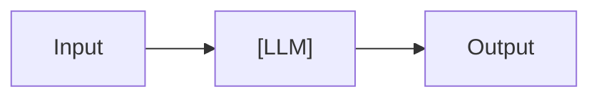

But production pipelines look more like this:

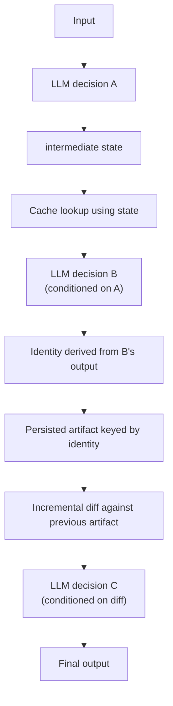

Each LLM call in this chain is a source of variance. And variance at step A propagates through every downstream step. By the time you reach the final output, you may have no idea whether the result changed because the real world changed, or because the LLM phrased something differently.

---

## 2. Why This Matters More Than You Think

### Non-Determinism Breaks Incremental Systems

Most production pipelines are not full-recompute systems. They are incremental: they track what changed, what was processed, what is stale. Git diffs, database change streams, event queues — incremental processing is how large systems stay affordable.

LLM non-determinism attacks the most critical assumption of any incremental system: **that unchanged inputs produce unchanged outputs**. When this assumption breaks, you get:

- False positives: "nothing changed but the system thinks something did"
- False negatives: "something changed but the system did not notice"
- Cascading re-computation that defeats the whole purpose of incrementalism
- Runaway costs in pay-per-call LLM APIs
- Continuous deployment loops triggered by phantom changes

### Non-Determinism Is Silent

Most bugs make something crash or produce obviously wrong output. Non-determinism usually produces output that looks correct. The analysis looks fine. The test passes. The CI is green. But on the next run, with identical inputs, you get slightly different output — and that tiny difference causes downstream components to do unnecessary work.

This kind of bug is extremely hard to find in code review. There is no test that reliably catches it because the tests themselves are non-deterministic.

### Non-Determinism at Scale Is Expensive

When a non-deterministic component sits inside a pipeline that runs on every commit, the cost compounds fast. Thirty unnecessary LLM calls per CI run, at $0.003-$0.006 per call, is $0.09-$0.18 per run. Across hundreds of commits per month, across multiple repositories, this is real money — before you even count the engineering time spent debugging "why did this change?"

---

## 3. Types of Software That Are Affected

Non-determinism is a concern whenever an LLM is used as more than a one-shot question-answerer. Specifically, it bites hardest in:

### 3.1 Automated Analysis and Report Generation

Systems that automatically generate and maintain structured reports from source code or other structured inputs are particularly vulnerable. Reports have identity: a report named `variant-a3f8.md` is expected to remain `variant-a3f8.md` across runs unless something actually changed. If the LLM renames an internal concept from "error path" to "failure branch," and the report ID is derived from that prose, you now have a stale old report and a spurious new one.

### 3.2 CI/CD Pipelines With LLM Gates

Any CI/CD pipeline that uses an LLM to make decisions (code review, test generation, diff analysis, deployment approvals) is exposed. A non-deterministic approval generates a non-deterministic pipeline state, which can cause flaky builds, unnecessary rollbacks, or missed deployments.

### 3.3 Code Analysis and Intelligence Tools

Tools that statically analyze code and use LLMs to resolve ambiguity (e.g., which concrete implementation is called through an interface) must cache their decisions. If the same ambiguity is re-resolved on every run and the answer varies slightly, downstream graph structures change, and the entire analysis becomes unstable.

### 3.4 Data Labeling and Classification Pipelines

Pipelines that use LLMs to classify or label data incrementally face the problem that re-classification of unchanged data can silently flip labels. If downstream models are trained or evaluated on these labels, model performance becomes non-reproducible.

### 3.5 Agentic and Multi-Step LLM Workflows

Agents that take actions across multiple steps — web browsing, tool use, code execution — amplify non-determinism geometrically. A different choice in step 2 produces a different context for step 3, which produces different tool calls in step 4. The final state of a multi-step agent workflow is highly sensitive to early variation.

### 3.6 RAG (Retrieval-Augmented Generation) Systems

RAG systems retrieve documents and synthesize answers. The retrieved documents depend on an embedding match, and the synthesis depends on which documents were retrieved. If the retrieval order or content changes slightly, the synthesized answer changes. If the system stores those answers as canonical truths, you have silent drift.

---

## 4. Types of Software That Are NOT Affected

Non-determinism is a real and costly problem — but it is not a universal problem. Many categories of software use LLMs heavily and are genuinely unaffected by output variance. Understanding why they are immune helps clarify what actually makes the affected cases hard.

The underlying pattern: **non-determinism only matters when the LLM's output is used as input to a system that has memory, identity, or state**. If the output is ephemeral and consumed immediately without being stored, compared, or built upon, variance is harmless.

### 4.1 One-Shot Question Answering

A user asks a question, the LLM answers, the answer is shown to the user, and the conversation ends. There is no downstream state that persists. The next time the same question is asked, no system is comparing the new answer to the old one. The user might notice the answer is different, but no pipeline breaks.

**Examples:** customer support chatbots, developer assistants, knowledge base Q&A, search-augmented chat.

**Why it is safe:** The answer is the final product. It is not a key, an identifier, a cache lookup, or the input to another automated system. Variance in prose is the expected behavior of a conversational interface.

### 4.2 Content Generation for Human Review

Systems that use LLMs to draft content that a human then reviews, edits, and approves before publication are effectively insulated from non-determinism. The human is the reconciliation layer. They see the draft, decide if it is good enough, and take responsibility for the output.

**Examples:** marketing copy generators, email drafting tools, blog post drafters, PR description generators, changelog summarizers.

**Why it is safe:** The human review step converts probabilistic output into a deliberate, deterministic human decision. The system never has to compare two LLM-generated drafts and decide whether they represent the same intent.

### 4.3 Creative and Generative Applications

Applications where the explicit design goal is variety — where users want different outputs each time — are not just unaffected by non-determinism, they depend on it. Controlled randomness is a feature, not a bug.

**Examples:** story generators, image prompt expanders, brainstorming tools, game dialogue systems, name generators, creative writing assistants.

**Why it is safe:** There is no baseline to drift from. Each generation is independent and its quality is judged on its own merits, not compared to previous generations.

### 4.4 Search and Ranking (Result Presentation Only)

Systems that use an LLM to summarize or rerank search results for a user, without storing those summaries or feeding them into further automated processing, are effectively stateless. Each search is a fresh query. The user gets an answer and moves on.

**Examples:** AI-augmented search interfaces, document summarization for search results, relevance explanation.

**Why it is safe:** The LLM output is presentation only. It is never written to a database, compared against a previous version, or used as a key in any system.

### 4.5 Translation and Transcription (Display Only)

Translation and transcription systems that display output to a user but do not store it in a structured system are low-risk. Small variations in phrasing across translations are acceptable — they are expected in natural language.

**Examples:** real-time captioning, document translation for reading, meeting transcription.

**Why it is safe:** Translation variance is a known property of natural language that users and downstream humans tolerate. The output is not parsed, hashed, or used as an identifier.

### 4.6 Classification With Human-in-the-Loop Correction

Pipelines where LLM classification feeds into a human review queue — where every output is reviewed before being acted upon — have the same insulation as content generation for human review. The human catches inconsistencies.

**Examples:** content moderation with human review, medical coding with clinician review, legal document classification with attorney review.

**Why it is safe:** The human step is the system's source of truth. The LLM is a tool to reduce human workload, not an authoritative decision maker.

### 4.7 Summarization of Streaming Data (No State Persistence)

Real-time summarization of logs, events, or telemetry that is displayed in a dashboard and discarded does not accumulate state. Each window of data produces a fresh summary. There is no previous summary to compare against.

**Examples:** log anomaly narration, real-time event stream summaries, live dashboard insights.

**Why it is safe:** The summary is a transient view of current state, not a persisted record. No downstream system depends on the summary being identical across repeated calls.

---

### The Dividing Line: Does Output Become State?

The clearest way to assess risk is to ask a single question:

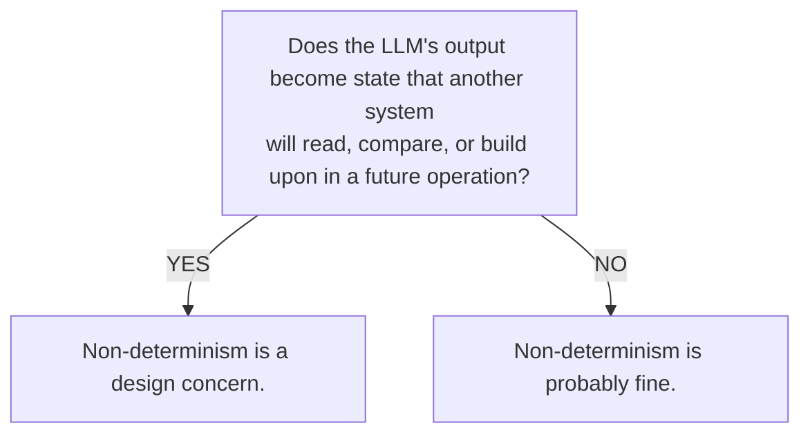

"State" here includes:
- Files written to disk or object storage
- Database records
- Cache entries used as keys
- Identifiers or IDs derived from LLM output
- Flags or decisions that trigger downstream automation
- Embeddings stored for later retrieval and comparison

If the LLM output is consumed immediately by a human or displayed ephemerally, you are in the safe zone. If it is persisted anywhere and later compared to new LLM output to determine "what changed," you are exposed.

A useful heuristic: **if you could run the same LLM call twice and the system would behave differently on the second call based on what the first call produced, non-determinism is a risk you need to manage.**

---

## 5. A Real-World Case Study: An LLM-Powered CI Analysis Pipeline

The system that motivates this post is a production CI pipeline for a large Go codebase. Its job is to automatically generate and maintain structured analysis reports for every entry point in the codebase — incrementally, on every commit. The pipeline combines static analysis with LLM-driven inference and persists its output to object storage, diffing against the previous run to determine what needs to be regenerated.

### 5.1 What the Pipeline Does

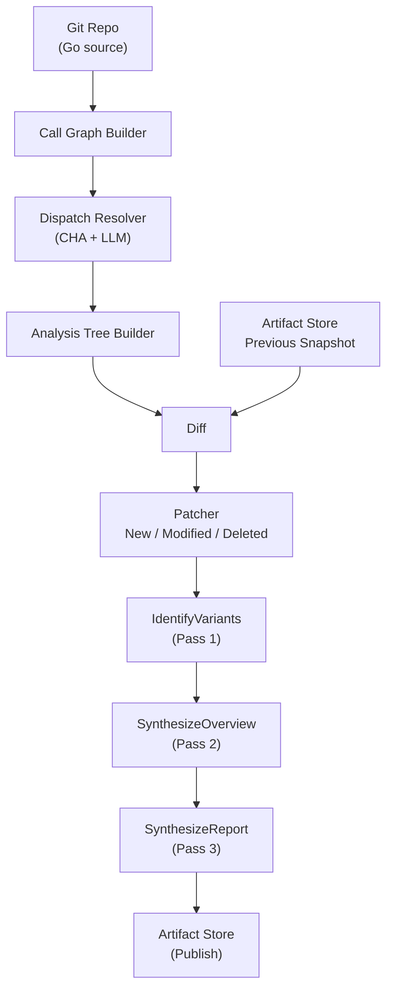

### 5.2 Where LLM Calls Happen

There are three distinct places where LLM calls are made:

**1. Dispatch Resolution (Pass 1 + Pass 2)**

Go uses interfaces extensively. When a method is called through an interface, there may be multiple concrete implementations. The pipeline uses Class Hierarchy Analysis (CHA) to enumerate candidates, then asks an LLM to resolve which concrete type is actually invoked in a given context.

```
Interface call: (BatchMessageProcessor).ProcessBatch
Candidates:
  - (*BatchHandler).ProcessBatch
  - recoveryDecorator.ProcessBatch
  - metricsDecorator.ProcessBatch
  - loggingDecorator.ProcessBatch

LLM Decision → (*BatchHandler).ProcessBatch [confidence: high]
```

**2. Variant Identification (Pass 1)**

For each entry point, the LLM is asked to identify distinct behavioral variants — "what are the different execution paths through this code?" It returns a list of variants with titles, descriptions, and the set of participating code nodes.

**3. Report Synthesis (Pass 2 + 3)**

For each variant, the LLM synthesizes a human-readable overview and a detailed structured report.

---

## 6. The Taxonomy of Non-Determinism in LLM Pipelines

After building and operating this pipeline, the non-determinism we encountered falls into six distinct categories. Understanding the category is the first step to fighting it.

### 6.1 Prose Drift

**What it is:** The LLM uses different wording to describe the same concept across runs.

**Example from our pipeline:**
- Run 1: `variant_condition: "when the message fails to unmarshal"`
- Run 2: `variant_condition: "on unmarshal error"`
- Run 3: `variant_condition: "if JSON deserialization fails"`

All three describe the same code branch. But if the artifact identity is derived from `variant_condition`, each run produces a different artifact ID. The old report becomes stale (but not deleted), and a near-duplicate new report is created.

**Blast radius:** Medium — cosmetically annoying, but also causes real cost from variant re-synthesis.

### 6.2 Structural Drift

**What it is:** The LLM returns structurally different output across runs — different number of variants, different groupings, different field presence.

**Example:**
- Run 1 returns 4 variants for an entry point
- Run 2 returns 3 variants (the LLM merged two)
- Run 3 returns 5 variants (the LLM split one further)

**Blast radius:** High — variant count changes trigger full re-synthesis for the affected entry point.

### 6.3 Ordering Drift

**What it is:** The LLM returns the same information but in a different order. If the pipeline derives any kind of index from position, this causes false positives.

**Example:**
```json
// Run 1:
{"participating_nodes": ["service.A", "service.B", "service.C"]}

// Run 2:
{"participating_nodes": ["service.C", "service.A", "service.B"]}
```

If the artifact ID is computed as `hash(participating_nodes)` without sorting, these hash to different values.

**Blast radius:** Low if the pipeline normalizes order; high if it doesn't.

### 6.4 Candidate Resolution Drift

**What it is:** For the same interface call with the same candidate set, the LLM selects a different concrete implementation on different runs.

**Example:**
- Run 1: resolves `(BatchMessageProcessor).ProcessBatch` → `(*payments/handler.Handler).ProcessBatch`
- Run 2: resolves the same call → `(*inventory/handler.BatchHandler).ProcessBatch`

Even if the LLM is "usually right," inconsistency here changes the call graph structure, which changes the analysis tree hash, which marks entry points as modified even when no code changed.

**Blast radius:** Very high — affects the entire downstream pipeline.

### 6.5 Format Drift

**What it is:** The LLM returns output in a subtly different format that the parser handles differently.

**Example from our pipeline:** For a dispatch call involving `(hash.Hash).Sum`, the LLM consistently returned `crypto/sha256.(*digest).Sum` — the pre-Go 1.24 internal type name. After a Go toolchain upgrade, the actual FQN changed to `(*crypto/internal/fips140/sha256.Digest).Sum`. The LLM didn't update its knowledge, so its output failed validation every time — but the failure was silent, and the site was re-attempted on every CI run, never successfully cached.

**Blast radius:** Medium — causes persistent cache misses for specific sites, cumulative cost.

### 6.6 External Non-Determinism (Call Graph Layer)

**What it is:** Non-determinism that appears to come from the LLM but actually originates in upstream infrastructure.

**Example:** The static call graph builder uses the Go type system to enumerate candidates. Some FQNs (particularly for stdlib internals, platform-specific types, and generic instantiations) can be generated differently depending on the Go toolchain version, build tags, or even iteration order over maps in the compiler. If the candidate list changes between runs, the dispatch cache key changes, the persisted entry is not reused, and the LLM is re-invoked.

This is a case where the non-determinism appears in the LLM layer but is actually caused by the calling layer.

**Blast radius:** High and deceptive — it looks like the LLM is behaving differently, but the LLM is actually consistent. The problem is the key that addresses its cache.

---

## 7. How Non-Determinism Cascades

The most important thing to understand about LLM non-determinism is that it doesn't stay local. It cascades.

Here is a concrete cascade from our pipeline:

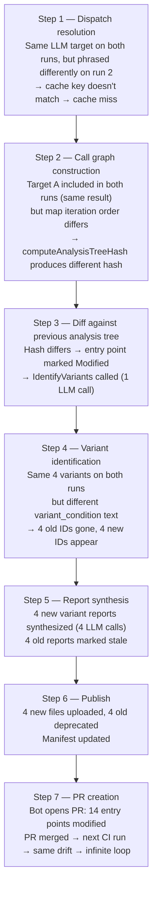

This is not a hypothetical. It happened in production.

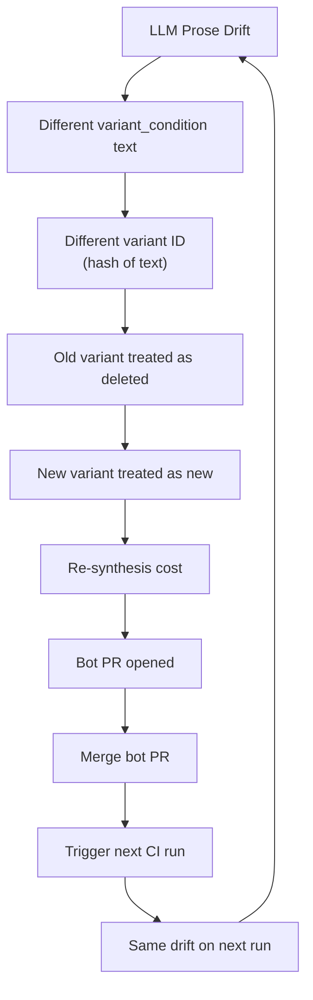

---

## 8. Real Incidents and Their Root Causes

### 8.1 Incident: 14 Entry Points Flagged Modified With No Code Change

**Observed:** A CI run reported `modified: 14, unchanged: 24` even though the target repository had no new source file changes between this run and the previous one.

**Investigation:** The pipeline does not use `git diff` to decide `Modified` vs `Unchanged`. Instead, it:
1. Loads the previous analysis snapshot from the artifact store
2. Rebuilds fresh analysis trees from the current source
3. Compares analysis tree hashes

When the dispatch cache was not fully reused across runs (due to validation failures we'll discuss in a moment), some interface calls were re-resolved. Even though the LLM chose the same targets, the rebuilt call graphs had slightly different internal structure, causing analysis tree hash mismatches.

The critical insight: **the pipeline concluded "modified" from analysis output drift, not from source-code drift.**

**Root cause:** Dispatch cache reuse failures caused partial call graph non-determinism, which caused analysis tree hash drift, which caused false-positive `Modified` classifications.

**Cost:** ~14 entry points × (~3 variants × 2 synthesis calls + 1 overview call) ≈ **84 unnecessary LLM calls per run**.

---

### 8.2 Incident: 15 False-Positive Re-Syntheses From One-Line Change

**Observed:** A one-character string literal change in a single handler function (`"unmarshaling message"` → `"unmarshaling inventory v2 message"`) triggered re-synthesis for 15 entry points. Only 1 was genuinely affected.

**The system is supposed to be incremental:** it has a change detection layer that computes a `CanonicalSourceHash` for each function (AST text, comments stripped) and only regenerates reports for variants whose `participating_nodes` intersect the changed nodes.

**Root cause: The dispatch cache key is context-free.**

The dispatch key was:
```go
func dispatchKey(invokedMethodFQN string, candidates []string) string {
    sorted := append([]string(nil), candidates...)
    sort.Strings(sorted)
    return invokedMethodFQN + "::" + strings.Join(sorted, "|")
}
```

This key contains the interface method and the sorted candidate set, but **not the caller**. This means every call site in the entire codebase that invokes the same interface method against the same candidates shares one cache entry.

The shared infrastructure pattern made this catastrophic:

```
internal/consumer/v2/consumer_pull.go
    │
    │  c.processor.ProcessBatch(ctx, batch)   ← one call site
    │
    ├── inventory/consumer/start_batch.go     ← wires BatchHandler
    ├── inventory/consumer/start_v2.go        ← wires HandlerV2
    ├── accounts/consumer/start_main.go       ← wires AccountsHandler
    ├── accounts/consumer/start_secondary.go
    ├── payments/consumer/start_primary.go
    └── payments/consumer/start_events.go
```

Six entry points, six different concrete types, one shared call site, one shared dispatch resolution. When `BatchHandler.ProcessBatch` changed, its `CanonicalSourceHash` changed, and the changed node appeared in every entry point that included the shared call site — all six entry points and their variants.

**Expected result:** `new:0, modified:1, deleted:0, unchanged:37`  
**Actual result:** `new:0, modified:15, deleted:0, unchanged:23`  
**Extra LLM calls:** ~84 unnecessary calls

The fix: include the caller FQN in the dispatch key, so each call site gets its own resolution scoped to its context.

---

### 8.3 Incident: 30 Dispatch Sites Missing Cache on Every Run

**Observed:** Two consecutive CI runs on `main` (no code changes between them) showed identical cache miss patterns:

```
dispatch resolver: collected ambiguities  sites=174  unique_keys=174
dispatch resolver: reused persisted cache  persisted_reused=144
dispatch resolver: pass 1 complete         pass1_calls=30
```

30 sites miss the cache on every single run, resulting in 30 unnecessary LLM calls per commit. This creates a permanent cost floor that no amount of caching can reduce.

**Root cause split into two categories:**

**Category 1 (~2 sites):** Parse failure — result never written to cache.

The LLM for `(hash.Hash).Sum` consistently returned `crypto/sha256.(*digest).Sum` — the pre-Go 1.24 internal type name. After a Go toolchain upgrade, the actual FQN changed to `(*crypto/internal/fips140/sha256.Digest).Sum`. The LLM didn't know about this change. Its response failed validation, was never written to cache, and the same call was made on every subsequent run with the same result.

Permanent loop:

```
Run N:   LLM call → parse failure → not written to cache
Run N+1: LLM call → parse failure → not written to cache
Run N+2: ...
```

**Category 2 (~28 sites):** Written to cache, but fails validation on next read.

Sites would parse successfully and be written to the persisted cache. But the following run would still miss them. Investigation pointed to two sub-causes:

- **Key mismatch:** The `constructorHash` or `candidatesHash` component of the cache key was computed differently on read vs write (due to non-deterministic candidate enumeration for certain types).
- **Graph lookup failure:** A selected FQN in the persisted entry was absent from the current call graph's `byFQN` map — meaning the FQN format changed subtly between toolchain invocations.

**Blast radius beyond cost:** Because ~30 sites resolved differently on each run, 3 entry points were classified as `Modified` on every CI run, triggering a bot PR on every commit merge — including merges of the bot PR itself. **Infinite bot PR loop.**

---

## 9. The Core Design Philosophy: Code Owns Identity

Every incident above has a common thread: **the system let LLM-generated prose determine the identity of artifacts**. The fix, in every case, is the same:

> **LLM output may propose candidates, but code-derived anchors must own identity.**

This is the single most important architectural principle for building reliable software on top of LLMs.

### 9.1 The Identity Principle

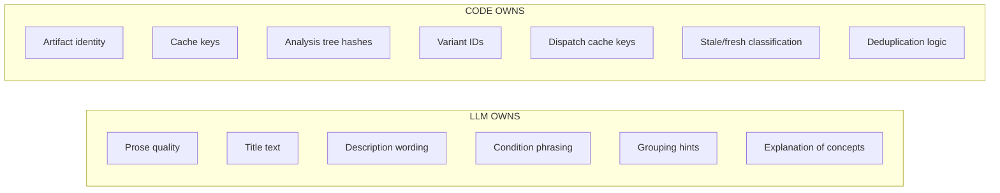

### 9.2 Stable Identity Anchors

In our pipeline, we identified the following code-derived anchors that remain stable across LLM runs:

| Artifact | LLM-Derived (unstable) | Code-Derived (stable) |
|----------|----------------------|----------------------|
| Entry point ID | `module_name` (LLM-named) | `hash(entry_point_fqn + entry_kind + trigger)` |
| Variant ID | `hash(variant_condition_text)` | `hash(entry_id + owner_fqn + branch_fqn + sorted_participating_nodes)` |
| Dispatch cache key | `(method, candidates)` | `(caller_fqn + method + sorted_candidates + wiring_hash + resolver_version)` |
| Analysis tree hash | Not applicable | `sha256(canonical JSON of tree structure and node source hashes)` |

### 9.3 The Reconciliation Pattern

The key insight for variant identity: you don't need the LLM to produce consistent IDs. You need to reconcile LLM output against code-derived anchors before any identity-sensitive operation.

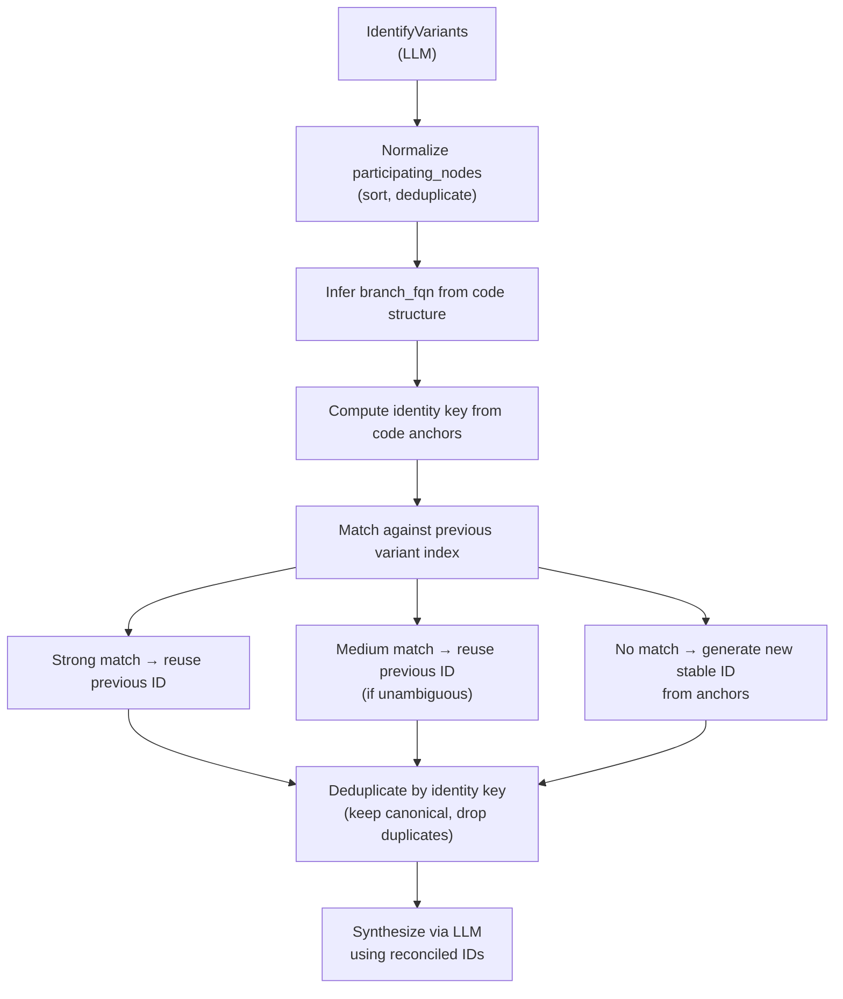

This way, even if the LLM describes the same variant with different words every run, the variant ID is stable because it's derived from the code structure, not the prose.

---

## 10. Mitigation Strategies in Depth

### 10.1 Structural Caching: The Dispatch Cache

The most impactful mitigation we implemented was persisting dispatch resolution decisions to object storage.

**Before:** Every CI run asked the LLM to resolve all interface call ambiguities from scratch.

**After:** Dispatch decisions are persisted with a rich cache key:

```go
type PersistedDispatchEntry struct {
    Key              string         `json:"key"`
    InvokedMethodFQN string         `json:"invoked_method_fqn"`
    Candidates       []string       `json:"candidates"`
    CandidatesHash   string         `json:"candidates_hash"`
    WiringHash       string         `json:"wiring_hash"`
    CallsiteHash     string         `json:"callsite_hash,omitempty"`
    Result           DispatchResult `json:"result"`
}
```

The cache key includes:
- The invoked method FQN
- The sorted candidate set
- A hash of the dependency injection wiring (the context the LLM uses to make its decision)
- A resolver version (for explicit invalidation when the LLM or prompt changes)

A persisted entry is only reused if all of the following are true:
- `schema_version` matches
- `resolver_version` matches
- `wiring_hash` matches (DI context hasn't changed)
- `candidates_hash` matches (the candidate set hasn't changed)
- All selected targets still exist in the current call graph

This brought dispatch cache hit rate from 0% (first run) to 83% (144/174 sites on subsequent runs), with the remaining 30 misses explained by the incidents above.

**The key design decision:** tie the cache key to the context that informs the LLM's decision. If the DI wiring changes, the decision may change too — so the cache must be invalidated. This is similar to how a database query cache invalidates when its input tables change.

### 10.2 Hash-Based Change Detection

Instead of comparing LLM-generated prose to detect changes, use code-derived hashes.

**Analysis tree hash:**

```go
func computeAnalysisTreeHash(tree *AnalysisTree) string {
    // Include: entry kind, entry trigger, entry FQN,
    //          node FQNs, node source hashes,
    //          boundary/recursion/truncated/dispatch_uncertain flags,
    //          ordered child relationships
    // Exclude: generation timestamp, LLM prose, absolute paths
    return sha256(canonicalJSON(treeStructure))
}
```

An entry point is `Unchanged` if and only if its analysis tree hash matches the previous hash. This is deterministic, fast, and immune to prose drift.

**Node source hash:**

```go
func computeCanonicalSourceHash(funcBody string) string {
    // Strip comments, normalize whitespace
    return sha256(normalizeAST(funcBody))
}
```

This gives us per-function change detection without relying on line numbers or file modification times, both of which are brittle in CI environments.

### 10.3 The Git Precheck: Deterministic Early Gate

Before any LLM work starts, a Git-based precheck can determine whether the commit range contains any code changes that could plausibly affect the generated output.

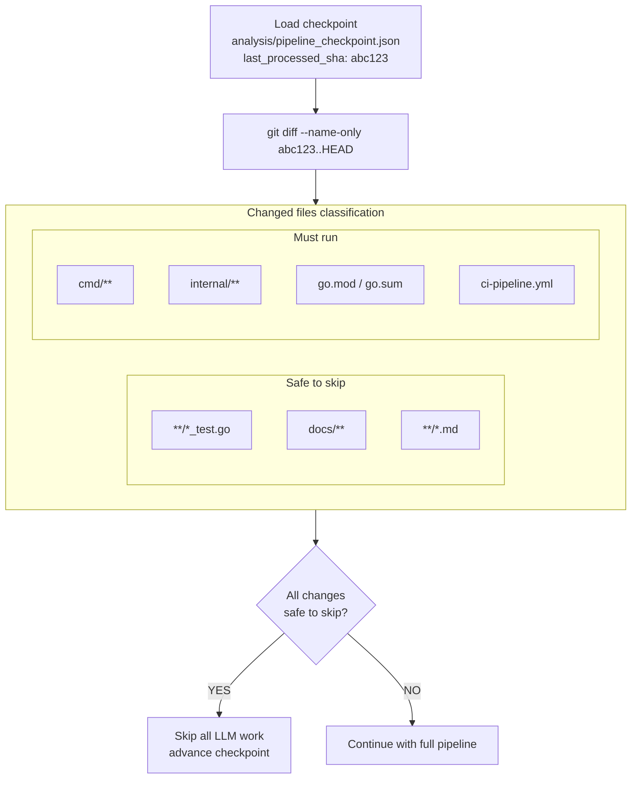

The precheck is designed to **fail open**: if any uncertainty exists (no checkpoint, unreachable SHA, inconclusive classification), it proceeds to the full pipeline. The optimization is only applied when confidence is high.

Critically, the precheck uses the **full range** from last processed SHA to HEAD — not just the current commit. This ensures that skipped intermediate commits are still considered when evaluating whether to run.

### 10.4 Variant Deduplication by Code Anchors

When the LLM is asked to identify variants for an entry point, it may return semantically identical variants worded differently. Code-anchor deduplication catches these before they reach synthesis:

**Deduplication key:**
```
entry_id + owner_fqn + branch_fqn + ordered_participating_nodes
```

When two variants share this key, keep one canonically:
1. Prefer the variant that reused a previous variant ID
2. Prefer the variant with non-empty `branch_fqn`
3. Prefer the variant with a more complete participating node set
4. Prefer first occurrence as tie-breaker

This prevents the LLM from generating 2x or 3x the expected number of reports just because it phrased the same variant differently in each.

### 10.5 Parse-Failure Persistence

When an LLM response fails validation (e.g., it returns an unrecognized FQN), don't silently drop it. Persist a low-confidence fallback:

```go
result, perr := parseDispatchResponse(respText, ambig.candidates, ambig.invokedMethodFQN)
if perr != nil {
    log.Warn("dispatch resolve: parse failed; persisting low-conf fallback",
        "method", ambig.invokedMethodFQN, "error", perr)
    // Low-confidence → all candidates used (CHA pass-through)
    // But the result IS written to cache, breaking the retry loop
    return DispatchResult{Confidence: "low"}, true
}
```

A low-confidence result has the same runtime behavior as a parse failure (all CHA candidates are used), but it stops the infinite retry loop. The LLM is not re-invoked for this site on the next run.

---

## 11. Operational Patterns for LLM Reliability

Beyond the pipeline-specific mitigations, there are operational patterns that apply to any production LLM system.

### 11.1 Per-Attempt Timeout

LLM providers can take arbitrarily long for individual responses, especially during degraded service. Without a per-attempt timeout, one slow call can block your entire pipeline.

```go
// Instead of:
resp, err := c.client.GenerateContent(ctx, ...)

// Do:
attemptCtx, cancel := context.WithTimeout(ctx, c.attemptTimeout)
defer cancel()
resp, err := c.client.GenerateContent(attemptCtx, ...)
```

Typical value: 60-120 seconds per attempt. With 3 retries and exponential backoff, worst-case per-call time is bounded to ~8-16 minutes rather than the provider's connection timeout (often 10+ minutes per attempt).

### 11.2 Global Concurrency Control

A common mistake is using nested concurrency limiters. If you have an outer limit of 4 (for clusters of work) and an inner limit of 4 (for items within each cluster), you can have 4×4=16 concurrent LLM calls when you intended to have 4.

Use a **single shared semaphore** for all LLM-backed operations:

```go
type synthesisLimiter struct {
    tokens chan struct{}
}

func (l *synthesisLimiter) run(ctx context.Context, fn func() error) error {
    select {
    case <-ctx.Done():
        return ctx.Err()
    case l.tokens <- struct{}{}:
    }
    defer func() { <-l.tokens }()
    return fn()
}
```

Pass this limiter through your entire call stack. The configured concurrency limit should mean exactly: the maximum number of concurrent LLM calls across the entire pipeline, not per level.

### 11.3 Circuit Breaker / Failure Budget

When the LLM service is degraded, you'll get a flood of 503 or deadline errors. Without a circuit breaker, your pipeline will exhaust its retry budget on every call, waste 10+ minutes, and eventually fail.

A failure budget is simpler than a full circuit breaker and sufficient for most batch pipelines:

```go
type llmFailureBudget struct {
    maxFailures int
    count       atomic.Int64
}

func (b *llmFailureBudget) record(err error) error {
    if !isLLMAvailabilityFailure(err) {
        return err  // Don't count parse errors, validation errors
    }
    if b.count.Add(1) >= int64(b.maxFailures) {
        return fmt.Errorf("llm failure budget exhausted: %w", err)
    }
    return err
}
```

Count: HTTP 503, `Unavailable`, `DeadlineExceeded`, `i/o timeout`.  
Don't count: JSON parse failures, validation errors, caller cancellation.

Budget exhaustion should fail the run cleanly and immediately — not after waiting for every in-flight call to timeout.

### 11.4 Prompt Versioning

The LLM's interpretation of a prompt changes when the prompt changes. This is obvious, but the consequence is less obvious: when you update a prompt, you should invalidate all cached decisions that were made with the old prompt.

Embed a `resolver_version` in your cache keys and increment it whenever your prompt changes meaningfully. This ensures that the first run after a prompt change re-resolves everything from scratch (acceptable), rather than mixing old and new resolutions in the same artifact (not acceptable).

### 11.5 Observability: What to Measure

For any LLM pipeline, instrument the following:

| Metric | Why It Matters |
|--------|---------------|
| `cache_hits` / `cache_misses` | Catch cache key instability |
| `llm_calls_per_run` | Catch non-determinism-driven cost growth |
| `parse_failures` | Catch prompt/format regressions |
| `false_positive_modified_count` | The ultimate integration test |
| `p50/p95/p99 latency per LLM call` | Catch service degradation |
| `variants_per_entry_point` (variance) | Catch structural drift |
| `artifact_churn_rate` (new/deprecated per run) | Catch identity instability |

A sudden spike in `cache_misses` or `llm_calls_per_run` with no code changes is almost always a sign of non-determinism. Set alerts on these.

---

## 12. Architecture Patterns for Deterministic LLM Pipelines

Putting all of the above together, here are the architectural patterns that distinguish a stable LLM pipeline from a flaky one.

### 12.1 The Two-Layer Architecture

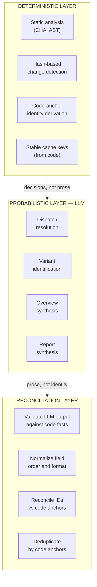

### 12.2 The Caching Strategy Pattern

Not all LLM calls should be cached the same way. Distinguish between:

| Call Type | Cache Strategy |
|-----------|---------------|
| Structural decisions (dispatch) | Persist to durable storage; invalidate on context change |
| Content synthesis (reports) | Cache by code hash; regenerate when code changes |
| One-shot creative tasks | Don't cache; accept variance |

The key insight: cache **decisions**, not **prose**. A dispatch decision ("this interface resolves to type X") is a structural fact that should remain stable. The prose explanation of why X was chosen is cosmetic and doesn't need to be cached.

### 12.3 The Candidate/Selection Pattern

When asking an LLM to select from a set of candidates, always:

1. Enumerate candidates deterministically (sorted, deduped)
2. Validate the LLM's selection against the candidate set (reject selections not in candidates)
3. Store the candidates hash in the cache key (so candidate-set changes invalidate the cache)
4. Handle selection failures gracefully (low-confidence fallback, not re-retry forever)

### 12.4 Separation of Identity and Content

**Anti-pattern:**
```
Artifact ID = hash(LLM-generated title)
```

**Correct pattern:**
```
Artifact ID = hash(code-derived anchors: entry_fqn + branch_fqn + participating_nodes)
Artifact content = LLM-generated prose (can vary without affecting ID)
```

This separation means prose can be freely re-generated (for quality improvements) without causing identity churn. It also means the same artifact can be updated with new prose without creating a new file.

### 12.5 The Validation-First Pattern

Before using any LLM output:

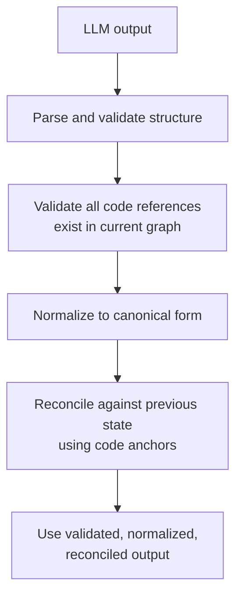

Never pass raw LLM output directly into identity-sensitive operations. Always validate first.

---

## 13. What Cannot Be Fixed

It is worth being honest about what these mitigations do not solve.

### 13.1 The LLM's Knowledge Is Frozen

The LLM's knowledge of your codebase is frozen at training time. It does not know about:
- New packages added to your repository
- Renamed interfaces or restructured types
- Framework upgrades that change FQN conventions

This means the LLM can produce plausible-looking but incorrect output for code patterns it hasn't seen, and the incorrectness may be subtle enough to pass validation. In our case, the `(hash.Hash).Sum` incident showed the LLM consistently returning a pre-upgrade FQN that looked valid but failed against the current call graph.

The mitigation is: validate LLM output against current code facts, not against what the LLM should know.

### 13.2 Fundamental Temperature Non-Determinism

Even with `temperature=0`, some providers do not guarantee identical outputs across all invocations. Hardware differences, model serving infrastructure, and internal implementation details can produce different outputs for identical inputs. The only mitigation is caching — but caching only helps for calls you've made before.

### 13.3 Context-Sensitive Dispatch Requires Context-Sensitive Analysis

The false-positive re-synthesis incident (15 entry points from 1 change) is only partially fixable with a context-scoped dispatch key. The deeper fix is context-sensitive pointer analysis (k-CFA instead of CHA). CHA is O(n) over the class hierarchy; k-CFA is polynomial and can be extremely slow on large codebases. For most production systems, CHA + LLM dispatch is the right tradeoff, but it cannot achieve the precision of a true context-sensitive analysis.

### 13.4 Prompt Changes Are Costly

Every time you improve your prompt, you pay the cost of re-resolving all previously cached decisions. This is unavoidable — a better prompt may produce genuinely different and better results, so old cached results are legitimately stale. The mitigation is `resolver_version` in cache keys, which makes invalidation explicit and controllable.

---

## 14. Summary and Checklist

Building software on top of LLMs that is reliable enough for production CI/CD requires treating the LLM as a **probabilistic black box that produces proposals, not facts**.

### The Core Principles

1. **Code owns identity.** Never derive artifact IDs, cache keys, or artifact names from LLM-generated prose. Use code-derived anchors (FQNs, hashes, structured types).

2. **Validate, normalize, reconcile before using.** Every LLM response should pass through a validation layer that checks code-derived facts, a normalization layer that canonicalizes format, and a reconciliation layer that matches against previous state.

3. **Cache decisions, not prose.** Persist structural decisions (dispatch resolutions, classification results) to durable storage with rich invalidation keys. Don't cache prose — it should be freely regenerable.

4. **Measure non-determinism directly.** Instrument for cache hit rate, LLM calls per run, parse failures, and artifact churn rate. Non-determinism is invisible without these metrics.

5. **Fail open safely.** When caching or validation fails, fall back to a deterministic default (e.g., CHA pass-through, all candidates used). Never re-retry forever — persist the failure result.

6. **Separate early gates from semantic gates.** Git-based prechecks can save LLM cost for obviously irrelevant changes, but they do not replace semantic diffing. Use both, in sequence.

### Production Readiness Checklist

- [ ] All cache keys include code-derived components, not LLM prose
- [ ] Cache keys include a `resolver_version` for prompt-change invalidation
- [ ] All LLM responses are validated against current code facts before use
- [ ] Parse failures are persisted as low-confidence results, not dropped
- [ ] Artifact and report IDs are derived from code anchors, not LLM text
- [ ] Per-attempt LLM timeout is configured (not relying on provider's connection timeout)
- [ ] Global concurrency limit is a single shared semaphore, not nested limits
- [ ] Circuit breaker or failure budget stops runaway retries on service degradation
- [ ] Metrics are in place for cache hit rate, LLM calls/run, and artifact churn rate
- [ ] False-positive modified artifact count is monitored with alerting
- [ ] Git precheck or equivalent avoids LLM calls for clearly irrelevant changes
- [ ] Integration tests verify that two consecutive identical runs produce identical output

---

## Further Reading

The patterns described in this post draw on established ideas from several fields:

- **Content-addressable storage** (CAS): the idea of keying artifacts by hash of their content, used in Git, Nix, and build systems like Bazel
- **Incremental computation**: systems like Salsa (Rust compiler) and Build Systems à la Carte provide formal frameworks for thinking about what must be recomputed when inputs change
- **Optimistic concurrency control**: validating cached results against current state before use, rather than assuming they're valid
- **Circuit breakers**: from Michael Nygard's "Release It!" — stopping cascading failures by detecting and short-circuiting failing dependencies
- **Context-sensitive program analysis**: Andersen's algorithm, k-CFA — the theoretical foundation for understanding why CHA + LLM is an approximation

---

*The incidents described in this post were observed in a production CI pipeline running on a large Go codebase with hundreds of entry points and thousands of LLM calls per week. All code examples are simplified for clarity. If you're building a similar system, the most important investment is not in prompt engineering — it is in the deterministic infrastructure around your LLM calls.*
