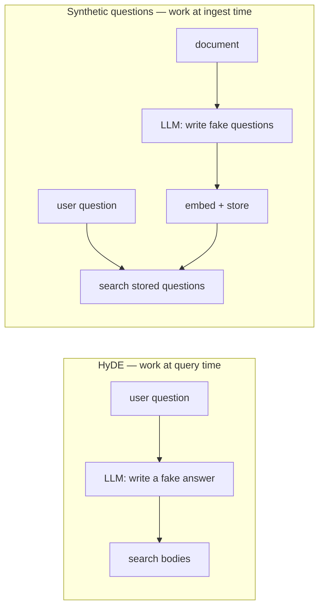
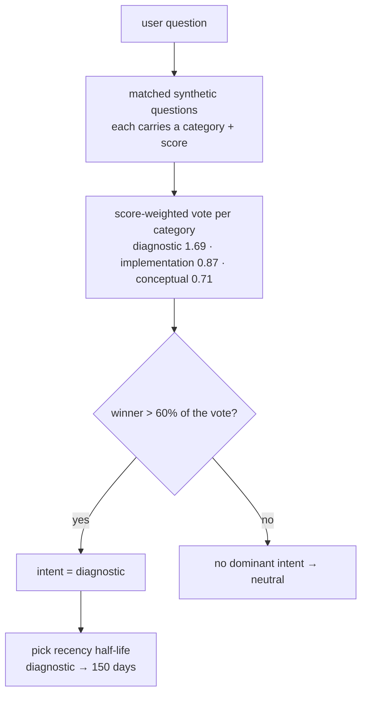

> *From building a production RAG pipeline over an internal engineering corpus. One decision I made at ingest time turned out to pay for itself twice — as the strongest retrieval signal in the system, and as a free query-intent classifier. This is that decision, and nothing else.*

---

## The mismatch at the heart of RAG

The default RAG recipe is three lines: embed every document, embed the user's question, return the nearest documents by cosine similarity. It works in demos, and it hides a mismatch that quietly caps its quality: **a question and the document that answers it do not look alike.**

A question is short and interrogative — *"Why does the consumer crash on unspecified events?"* The document that answers it is long and declarative: paragraphs about enum handling, a code block, a note about a dead-letter queue — and it may never contain the word "crash." In embedding space they land near each other, but not as near as you'd want.

You can measure the gap. Take a corpus, generate natural questions, compare three ways:

| Comparison | Typical cosine |
|---|---|
| Question ↔ the document body that answers it | **0.69** |
| Question ↔ a *different question* on the same topic | **0.86** |
| Question ↔ a question on an *unrelated* topic | 0.53 |

Two questions about the same thing sit at **0.86**. A question and its answering body sit at **0.69** — a ~0.17 gap, right in the band where ranking is decided. Every time you match a question against a body, you're leaving that gap on the table.

So: if the tightest match is question-to-question, match the user's question against *questions*. At query time you only have one — the user's. Where do the rest come from? Ingest time.

## The idea: ask the questions at ingest time

When a document is ingested, an LLM writes down the questions it answers, each tagged with a category:

```json
{"synthetic_queries": [
  {"category": "diagnostic",     "question": "Why do unspecified event types route to the dead-letter queue?"},
  {"category": "implementation", "question": "How do I change the retry backoff for the batch consumer?"},
  {"category": "conceptual",     "question": "What is the difference between a batch handler and a stream handler?"}
]}
```

These **synthetic questions** are embedded and stored as a first-class retrieval target of their own — one row per question, each pointing back at its document. At query time, the user's question is compared against *them*. You're back in the 0.86 regime instead of the 0.69 one.

This is [HyDE](https://arxiv.org/abs/2212.10496) turned inside out. HyDE fixes the same asymmetry by generating a fake *answer* at query time — an LLM call on every request. Synthetic questions do the mirror image, *once, offline*: generate fake *questions* per document at ingest, embed them, store them. At query time there's no extra LLM call — you just search a table.



One detail makes it rigorous: modern embedding models are dual-encoders with a *task type*. Embed document bodies as `RETRIEVAL_DOCUMENT`, synthetic questions and the runtime query as `RETRIEVAL_QUERY`. Comparing the query against the questions is then a clean query-vs-query match; comparing it against bodies is the asymmetric case the task types were built to reconcile. You embed the user's question once and let it search both.

## The payoff you didn't plan for: free intent classification

Here's where the one decision pays off a second time.

Different questions want different treatment. *"Why is the consumer crashing right now?"* wants the freshest runbook. *"Why did we choose Postgres over DynamoDB?"* wants the original design doc, however old. To treat them differently you have to know which kind of question was asked — and the usual way to find out is a **query router**: an extra LLM call at the top of the pipeline, costing latency and a per-query call, and a second place where labels drift.

You don't need it, because you already classified at ingest time — every synthetic question carries a `category` from a small taxonomy: `diagnostic`, `implementation`, `conceptual`, `navigational`, `temporal`. So after the question search runs, you don't just know *which documents* matched — you know *which kinds of questions* matched, and how strongly. Sum them, weighted by similarity:

```go
weights := map[string]float64{}
for _, m := range matchedQuestions {
    weights[m.Category] += m.Score   // score-weighted vote
}
```



For *"why is the consumer crashing on unspecified events?"*, the matches vote `diagnostic 1.69, implementation 0.87, conceptual 0.71` — dominant intent **diagnostic**, inferred with zero LLM calls in under a millisecond. Trust it only when the winner clears a majority (`top/total > 0.6`); otherwise fall back to neutral. That's the property a router can't match — on a query the corpus can't answer, inference says "I don't know" and behaves like a plain hybrid retriever, instead of emitting a confident wrong label.

| | Query router | Free inference |
|---|---|---|
| Extra LLM call per query | yes (~200–500ms) | no |
| Cost per query | one LLM call | zero |
| Unanswerable query | confident wrong label | falls back to neutral |
| Source of truth for labels | router + consumers, can drift | one `category` column |

The synthetic questions are, in effect, an **inverted intent index**: instead of asking "what kind of question is this?" you precomputed "what kinds of questions does each document answer?" — and the user's question becomes whichever kinds it most resembles. That intent then does its job: it picks a recency half-life, so `temporal` answers decay in weeks while `conceptual` ones stay valid for years — same retriever, age applied the way each kind of question wants.

## What it costs

Two honest caveats. If the ingest LLM tags questions unevenly — say 80% `implementation` — every query starts looking implementation-heavy, and the intent signal degrades; you have to monitor the category distribution. And a query that matches few synthetic questions gets an unreliable vote; the confidence floor catches it, but "neutral" means you've lost the tuning for exactly the queries the corpus serves worst. The signal is only as good as the questions behind it.

## The takeaway

The whole thing is one move with two payoffs: **generate categorized synthetic questions per document at ingest, and embed them as a first-class retrieval target.** It gives you the tightest retrieval signal available (question-to-question, ~0.86 vs ~0.69), and it hands you free query-intent classification because those questions carry their category.

The general lesson outlasts the trick: before adding a component to your hot query path — a router, a classifier, a second model call — check whether something you already compute at ingest time secretly contains the answer. Ingest is batched, retryable, and off the user's critical path. The cheapest query-time work is the work you already did.
