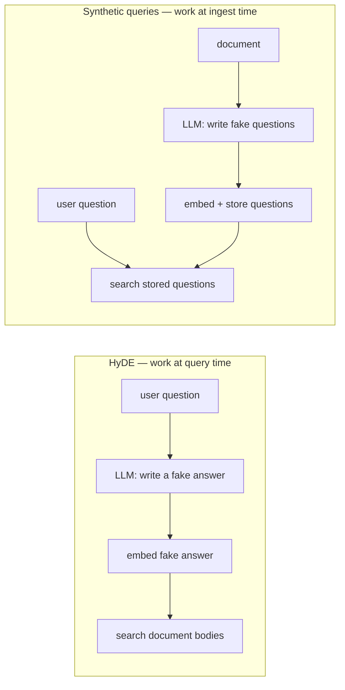
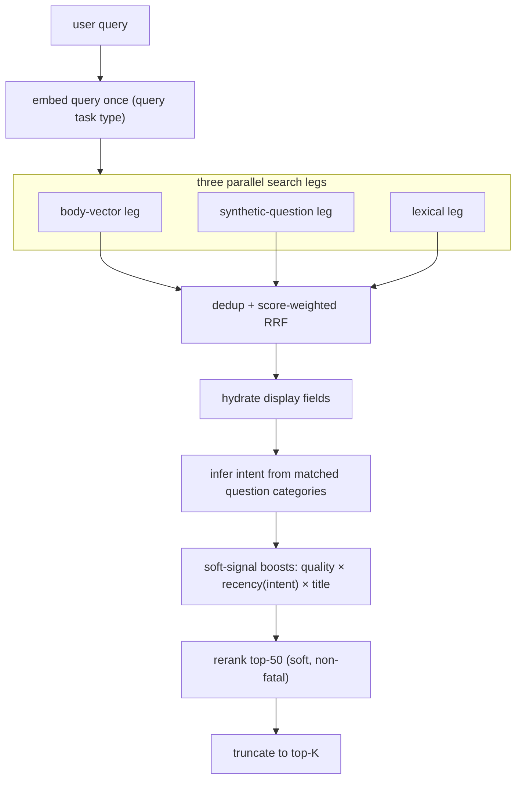

> *This post is drawn from building a production RAG pipeline for internal engineering knowledge — markdown docs (design docs, runbooks, incident notes, Slack threads, code documentation) ingested into Postgres with pgvector, served to a Slack bot and a CLI. Somewhere in the middle of building the retrieval side, I realized that one decision I had made at ingest time was quietly paying for itself twice. This post is about that decision, the whole retrieval pipeline built around it, and the free query-intent classifier that fell out of it. Everything here is generalizable; none of it is specific to the domain the system happens to serve.*

---

## Table of Contents

1. [The Asymmetry Nobody Designs Around](#1-the-asymmetry-nobody-designs-around)
2. [The One Idea: Ask the Questions at Ingest Time](#2-the-one-idea-ask-the-questions-at-ingest-time)
3. [The Retrieval Pipeline, End to End](#3-the-retrieval-pipeline-end-to-end)
4. [The Three Legs and Why Each Exists](#4-the-three-legs-and-why-each-exists)
5. [Fusion: Score-Weighted RRF (and the Trap It Opens)](#5-fusion-score-weighted-rrf-and-the-trap-it-opens)
6. [The Payoff: Free Query-Intent Classification](#6-the-payoff-free-query-intent-classification)
7. [Turning Intent Into Behavior: Intent-Keyed Recency](#7-turning-intent-into-behavior-intent-keyed-recency)
8. [Reranking as a Soft Stage](#8-reranking-as-a-soft-stage)
9. [What This Does NOT Fix](#9-what-this-does-not-fix)
10. [How Far You Can Push It: Source-Grounded Questions](#10-how-far-you-can-push-it-source-grounded-questions)
11. [Summary and Checklist](#11-summary-and-checklist)

---

## 1. The Asymmetry Nobody Designs Around

The default RAG retrieval recipe is three lines long:

1. Embed every document.
2. At query time, embed the user's question.
3. Cosine-compare the question vector against the document vectors, return the nearest.

It works well enough in demos, and it hides a mismatch that quietly caps its quality: **a question and the document that answers it do not look alike.**

A question is short, interrogative, and framed around a symptom or a goal: *"Why does the consumer crash on unspecified events?"* The document that answers it is long, declarative, and framed around a mechanism: three paragraphs about enum handling, a code block, a note about a dead-letter queue, none of which contain the word "crash." In embedding space these two live near each other — but not *as* near as you'd like, because you're comparing two genuinely different shapes of text.

You can measure this. Take a corpus, generate a set of natural questions, and compare cosine similarities three ways:

| Comparison | Typical cosine |
|---|---|
| Question ↔ the document body that answers it | **0.689** |
| Question ↔ a *different question* on the same topic | **0.855** |
| Question ↔ a question on an *unrelated* topic | 0.526 |

Two questions about the same thing land at **0.855**. A question and the body that answers it land at **0.689**. That gap — ~0.17 of cosine, right in the band where ranking decisions are made — is signal you are leaving on the table every time you match a question against a body.

The obvious reading is "question-to-question matching is tighter than question-to-document matching." The useful reading is: **if I want the tightest match, I should be comparing the user's question against questions, not against documents.** But at query time I only have one question — the user's. Where would the other questions come from?

They come from ingest time. That is the whole idea.

---

## 2. The One Idea: Ask the Questions at Ingest Time

When a document is ingested, an LLM reads it and writes down the questions this document answers — a handful of them, each tagged with a category:

```json
{
  "synthetic_queries": [
    {"category": "diagnostic",     "question": "Why do unspecified event types get routed to the dead-letter queue?"},
    {"category": "implementation", "question": "How do I change the retry backoff for the batch consumer?"},
    {"category": "conceptual",     "question": "What is the difference between a batch handler and a stream handler here?"}
  ]
}
```

These are called **synthetic queries** (or synthetic questions — same thing). They are embedded and stored *alongside* the document, as a first-class retrieval target of their own. Now the corpus contains not just documents, but a large set of pre-written questions, each pointing back at the document that answers it.

At query time, the user's question is compared against *those questions*. You are back in the 0.855 regime instead of the 0.689 regime — question-to-question, the comparison the earlier table said was tightest.

This is HyDE turned inside out. [HyDE](https://arxiv.org/abs/2212.10496) (Hypothetical Document Embeddings) fixes the same asymmetry from the other end: at query time it asks an LLM to hallucinate a *fake answer* to the user's question, embeds that, and searches document bodies with it — paying an LLM call and its latency on *every query*. The synthetic-query approach does the mirror image, and does it *once, offline*: generate fake *questions* per document at ingest, embed them, store them. At query time there is no extra LLM call — you just search a table.



### The embedding-asymmetry detail that makes it rigorous

There is a subtlety that separates "cute idea" from "correct implementation." Modern embedding models are **dual-encoder** models: they expose a *task type* that tells the model whether the text is a document to be stored or a query to be searched with. The two task types deliberately produce vectors in slightly different subspaces, tuned so that a *query-typed* vector lands near the *document-typed* vector that answers it.

So there are two ways to embed text here, and getting them right matters:

- **Document body** → embedded with the **document** task type, stored in the body index.
- **Synthetic questions** → embedded with the **query** task type, stored in the questions index.
- **The user's question at runtime** → embedded once, with the **query** task type.

That single runtime query vector is then fanned out to *both* indexes:

- Against the **synthetic-question index**, it is a **query-vs-query** comparison — symmetric, both sides embedded as queries. This is the high-signal path.
- Against the **document-body index**, it is a **query-vs-document** comparison — the asymmetric path the task types were literally designed to reconcile.

You do not need two different query embeddings. You need one, embedded as a query, compared against two populations that were themselves embedded with the appropriate task type. The model's own task typing does the reconciliation.

### The schema

Two tables, two vector indexes. Nothing exotic:

```sql
-- one row per document
CREATE TABLE document_embeddings (
    doc_id             TEXT NOT NULL REFERENCES documents(doc_id) ON DELETE CASCADE,
    embedding_model_id INT  NOT NULL,
    embedding          VECTOR(768),
    UNIQUE (doc_id, embedding_model_id)
);

-- one row PER SYNTHETIC QUESTION — a doc has many
CREATE TABLE query_embeddings (
    doc_id             TEXT NOT NULL REFERENCES documents(doc_id) ON DELETE CASCADE,
    embedding_model_id INT  NOT NULL,
    category           TEXT NOT NULL,     -- the intent tag; more on this in §6
    question           TEXT NOT NULL,
    embedding          VECTOR(768)
);

CREATE INDEX ON document_embeddings USING hnsw (embedding vector_cosine_ops);
CREATE INDEX ON query_embeddings    USING hnsw (embedding vector_cosine_ops);
CREATE INDEX ON query_embeddings (category);
```

The important difference is the cardinality. `document_embeddings` has one row per document. `query_embeddings` has one row *per question*, so a single document is represented by several question-vectors, each an independent way in. And each carries a `category` — hold that thought until §6, because it is where the second payoff comes from.

One more thing worth doing at ingest, before you spend a single embedding call: **a quality gate**. An LLM scores each document for whether it can actually answer questions at all; anything below a threshold is quarantined and never embedded. There is no point generating synthetic questions for a doc that is a stub, a redirect, or a wall of logs. Cheap questions come from documents worth asking about.

---

## 3. The Retrieval Pipeline, End to End

The idea above is the foundation. The retrieval pipeline is what turns it into good answers. Here is the whole thing:



A few properties worth naming up front, because they recur:

- **The query is embedded exactly once.** That one vector feeds two of the three legs. Embedding is the only network call on the hot path before reranking.
- **The three legs run concurrently.** They are independent SQL statements; an error-group runs them in parallel and fails fast if any leg errors.
- **Everything after fusion is a pure function over an in-memory slice.** Intent inference, boosting, and truncation touch no I/O. That makes them fast, testable, and deterministic — the whole ranking tail can be unit-tested with a fake clock and no database.
- **The two LLM-flavored stages are optional or offline.** Synthetic-question generation happened at ingest. Reranking is a managed API call that the pipeline treats as *advisory* — if it fails, retrieval still returns a well-ordered list (§8).

The rest of the post walks these stages, in order, and stops to point out the two places where something genuinely unusual is happening: fusion (§5) and intent (§6).

---

## 4. The Three Legs and Why Each Exists

Three legs, three different notions of "relevant." Each catches what the others miss.

### 4a. Body-vector leg

Straight cosine similarity against the document-body index. This is the classic RAG leg, and it is the safety net: it will find a topically-relevant document even when no synthetic question happens to match and the user's words never appear verbatim.

```sql
SELECT e.doc_id, 1 - (e.embedding <=> $1) AS score
FROM document_embeddings e
JOIN document_metadata m USING (doc_id)
WHERE e.embedding_model_id = $2
  AND m.low_confidence = false
ORDER BY e.embedding <=> $1
LIMIT $3;
```

The score is `1 - cosine_distance`, i.e. cosine similarity in `[0, 1]`. Remember that range — it matters in §5.

### 4b. Synthetic-question leg

The star. Same shape, different table — and it returns two extra columns that turn out to be load-bearing: the matched `question` and its `category`.

```sql
SELECT q.doc_id,
       q.category  AS matched_category,
       q.question  AS matched_question,
       1 - (q.embedding <=> $1) AS score
FROM query_embeddings q
JOIN document_metadata m USING (doc_id)
WHERE q.embedding_model_id = $2
  AND m.low_confidence = false
ORDER BY q.embedding <=> $1
LIMIT $3;
```

Because there is one row per question, **the same document can appear several times** in this leg's results — once for each of its questions that matched. That is not a bug to dedup away thoughtlessly; each match is evidence. The fuser collapses them to one hit per document but *keeps every match on the side*, because the categories of all those matches are exactly what powers free intent inference (§6). The `matched_question` also becomes the highest-signal thing you can hand a reranker (§8).

### 4c. Lexical leg

Full-text search over a `tsvector`. This leg exists to catch the things vectors are bad at: exact identifiers, error codes, function names, acronyms — tokens where a near-synonym is *wrong*, not merely less good. If someone searches for `ADCREDITS_EVENT_TYPE_UNSPECIFIED`, you want the document containing that literal string, and no amount of semantic similarity substitutes for it.

There is one non-obvious trick here. Postgres's `plainto_tsquery` joins terms with `AND`, so a multi-word query only matches documents containing *every* term — far too strict for a leg whose whole job is recall inside a fusion. The fix is to rewrite the parsed query's `AND` operators into `OR`:

```sql
SELECT d.doc_id, ts_rank(d.search_vector, q.tsq) AS score
FROM documents d
JOIN document_metadata m USING (doc_id),
LATERAL (
  SELECT NULLIF(
           regexp_replace(plainto_tsquery('english', $1)::text, ' & ', ' | ', 'g'),
           ''
         )::tsquery AS tsq
) q
WHERE q.tsq IS NOT NULL
  AND d.search_vector @@ q.tsq
ORDER BY score DESC
LIMIT $2;
```

You still get `plainto_tsquery`'s stemming, stopword removal, and hyphen handling — you just flip the combinator to disjunctive by string-rewriting `' & '` to `' | '`. The `NULLIF(..., '')` guards the degenerate case where the query is nothing but stopwords: the parsed query becomes empty, `tsq` becomes `NULL`, and the leg returns zero rows instead of throwing. Small, ugly, effective — and not something you'll find in a tutorial.

---

## 5. Fusion: Score-Weighted RRF (and the Trap It Opens)

Three legs return three ranked lists on three incomparable scales: cosine in `[0,1]` for the vector legs, unbounded `ts_rank` for the lexical leg. You cannot just add the scores. The standard answer is **Reciprocal Rank Fusion (RRF)**, which throws the scores away entirely and fuses on *rank position*:

```
fused(doc) = Σ over each leg L containing doc:  1 / (k + rank_L(doc))     // k = 60
```

RRF is popular because it is robust and scale-free: it doesn't care that one leg emits 0.9 and another emits 4.2, only that a document came 1st, 2nd, 3rd. But look closely at what it discards. A document at rank 1 with cosine **1.0** (an exact match) and a document at rank 1 with cosine **0.4** (a weak match that happened to be the best of a bad lot) get the *identical* contribution: `1 / (60 + 1)`. You paid to compute a precise similarity score in every leg, and then the fusion step deletes it.

That has a real consequence. With rank-only RRF, all fused scores compress into a narrow band — a document matching all three legs at rank 1 scores `3/61 ≈ 0.049`; a single-leg rank-1 match scores `1/61 ≈ 0.016`. The entire corpus lands inside a ~3–5× spread. Then the downstream soft-signal boosts (§7), which multiply by factors spanning ~0.5–1.15×, are large enough relative to that compressed band to *reorder* it — meaning a recency or title nudge can override genuine relevance differences that the fusion flattened away.

The fix is small: put the score back into the numerator.

```go
// score-weighted RRF: each leg contributes its similarity, scaled by reciprocal rank
for leg, rank := range bestRankPerLeg {
    fused += bestScorePerLeg[leg] / float64(k+rank)   // was: 1.0 / (k + rank)
}
```

Now an exact match at rank 1 contributes `1.0/61` while a weak match at the same rank contributes `0.4/61` — a 2.5× differentiation the rank-only formula erased. Multi-leg corroboration still wins (a document appearing in all three legs still accumulates three terms), but *within* a leg, a strong match now beats a weak one at the same rank. Fused scores spread out, and the boosts go back to being tiebreakers instead of overrides.

### The trap this opens — and the guardrail for it

Score-weighting is not free. The moment you multiply by raw scores, **the legs' scales stop being irrelevant.** The vector legs are bounded in `[0,1]`. The lexical `ts_rank` is *not* bounded — it usually sits in `0.0001–0.5`, but nothing stops it exceeding 1.0 on a pathological document. If it does, the lexical leg's contribution silently balloons and skews the fusion toward lexical hits.

Rank-only RRF is immune to this by construction; score-weighted RRF is not. So the pipeline keeps a guardrail: after the lexical leg runs, it scans for any score above 1.0 and logs a warning that cross-leg weighting may be skewed. It doesn't crash — it surfaces the exact failure mode the non-standard fusion introduced, so a human notices before it quietly degrades ranking. The lesson generalizes: **if you trade a robust default for a sharper one, instrument the assumption the default gave you for free.**

---

## 6. The Payoff: Free Query-Intent Classification

Here is where the one ingest-time decision pays for itself a second time.

Different questions want different retrieval behavior. *"Why is the consumer crashing right now?"* wants the most recent runbook, even a terse one. *"Why did we choose Postgres over DynamoDB?"* wants the original design doc, however old. Same retriever, opposite treatment of document age. To treat them differently, you have to know which *kind* of question was asked.

The standard way to get that is a **query router**: an extra LLM call at the top of the pipeline whose only job is to classify the question — `{intent: "diagnostic"}`. It works, and it costs you a per-query LLM call, 200–500ms of latency (which Slack users feel), and a second place where labels can drift out of sync with the rest of the system.

You don't need it, because you already did the classification at ingest time — you just didn't notice. Every synthetic question carries a `category`, drawn from a small fixed taxonomy:

| Category | The kind of question it marks |
|---|---|
| `diagnostic` | why something breaks — root cause, symptoms, debugging |
| `implementation` | how to do something — code, config, setup |
| `conceptual` | what something is — architecture, behavior, definitions |
| `navigational` | where/who — locate a file, dashboard, owner |
| `temporal` | when — timelines, deprecation dates, incident resolution |

So after the synthetic-question leg runs, you don't just know *which documents* matched — you know *which kinds of questions* matched, and how strongly. Aggregate them:

```go
// weight each matched question's category by its similarity score
weights := map[string]float64{}
for _, m := range hit.MatchedOn {
    if m.Leg == "query" && m.Category != "" {
        weights[m.Category] += m.Score
    }
}
```

A worked example. The user asks *"why is the consumer crashing on unspecified events?"* and the synthetic-question leg lights up:

| Matched synthetic question | Category | Score |
|---|---|---|
| "Why do unspecified event types route to the DLQ?" | `diagnostic` | 0.91 |
| "How does the handler route unspecified events?" | `implementation` | 0.87 |
| "Why is there a discrepancy in the event counts?" | `diagnostic` | 0.78 |
| "What is the purpose of the Result struct?" | `conceptual` | 0.71 |

Summed by category: `diagnostic 1.69`, `implementation 0.87`, `conceptual 0.71`. Dominant intent: **diagnostic** — inferred with zero extra LLM calls, in well under a millisecond, from data you already had.

### The confidence floor

A raw `argmax` over the vote is not enough — a query that matches nothing cleanly would still produce *some* winner, and you'd specialize behavior on noise. So the dominant intent is only trusted when it captures a real majority of the vote:

```go
confident := topScore/total > 0.6      // hardcoded floor
```

If the top category doesn't clear 60% of the total weight, the query is treated as **no dominant intent**, and the pipeline falls back to neutral behavior. This is the graceful-degradation property a router can't match: on a query the corpus can't answer well, a router still emits a confident-looking label that means nothing, whereas inference simply says "I don't know" and behaves like a vanilla hybrid retriever. It fails to *neutral*, not to *wrong*.

### Why this works at all

The synthetic queries are, in effect, an **inverted intent index**. Instead of asking "what kind of question is the user asking?" you precomputed "what kinds of questions does each document answer?" — and at query time, the user's question simply *becomes* whichever kinds of questions it most resembles in the corpus. The classification was outsourced to ingest time and batched. The retriever consumes it for free, forever, on every query.

| Property | Query router (typical) | Intent inference (here) |
|---|---|---|
| Extra LLM call per query | yes (~200–500ms) | no |
| Per-query cost | one LLM call | zero |
| Fails on unanswerable queries by… | emitting a confident wrong label | falling back to neutral |
| Source of truth for labels | router prompt + downstream, can drift | one `category` column |
| Adding a new category | update router + consumers | update the ingest prompt, re-ingest |

The one thing a router still does better: it can classify signals the corpus doesn't carry (say, user frustration vs. curiosity). If you ever need that, the two *compose* — a router on top of inference, not instead of it. Inference handles everything the corpus can answer, which is almost everything.

---

## 7. Turning Intent Into Behavior: Intent-Keyed Recency

The inferred intent has exactly one job in the base pipeline: it picks the **recency half-life**. Fused, topically-ranked hits then get three cheap, multiplicative boosts:

```
BoostedScore = FusedScore × quality × recency(intent) × title
```

Multiplicative, because it encodes *and* semantics — a document is a great hit when it is on-topic **and** high-quality **and** fresh **and** its title matches. Any one factor dropping pulls the whole score down proportionally, across factors that live on completely different scales. All three boosts are pure arithmetic over the in-memory slice: no network, no LLM, sub-millisecond.

### Recency — penalty-only, intent-keyed

Recency is where intent cashes out. The multiplier is an exponential half-life decay on document age, but with two deliberate design choices:

```go
ageDays := math.Floor(now.Sub(sourceDate).Hours() / 24)   // day-floored
if ageDays < 0 { ageDays = 0 }                             // future dates → age 0
raw := math.Pow(0.5, ageDays/halfLifeForIntent)
recency := math.Max(raw, 0.5)                             // floor at 0.5
```

1. **Penalty-only.** Fresh documents get a multiplier of exactly `1.0` — no *bonus*. Old documents get demoted, but never below `0.5`. Recency can at most *halve* a score; it can never resurrect a topically-weak document just because it's new. This keeps relevance in charge and age as a tiebreaker.
2. **Day-floored age.** Sub-24h differences round to zero, so documents don't thrash in rank by the hour.

And the half-life itself is chosen by intent — the whole point of §6:

| Intent | Half-life (days) | Reading |
|---|---|---|
| `temporal` | 60 | "when did X happen" — freshness is almost the whole point |
| `diagnostic` | 150 | troubleshooting wants current state, but recurring issues keep old incidents useful |
| `implementation` | 360 | how-tos drift, but slowly |
| `navigational` | 500 | file locations change slowly |
| `conceptual` | 1095 | ADRs and definitions stay valid for years |
| *(no dominant intent)* | 360 | neutral fallback |

That's an 18× spread between `temporal` and `conceptual`. The same six-month-old runbook is demoted to the floor under a `diagnostic` query and barely touched under a `conceptual` one — driven entirely by the free intent signal. And when intent isn't confident (§6), `dominant` is blanked and every document gets the neutral 360-day curve. The confidence floor doesn't just label a query; it decides whether the pipeline specializes at all.

### Quality and title — intent-independent

- **Quality:** `quality_score ^ 0.4`. The enricher writes a `[0,1]` quality score per doc; the `0.4` exponent compresses it so quality is a ~10% tiebreak between adjacent tiers, never a dominant term. (Missing score → `1.0`, no penalty.)
- **Title:** a flat `1.15×` if *any* stopword-stripped query token exactly matches a title token. Title-term match is the highest-precision cheap signal in retrieval: a document *titled* `handler.go` should beat a long thread that mentions "handler" once. The tokenizer preserves intra-token punctuation on purpose, so `handler.go` stays one token and matches cleanly.

A worked composition, for a `diagnostic` query (half-life 150):

| Doc | FusedScore | quality | recency | title | Boosted |
|---|---|---|---|---|---|
| A: old `handler.go` (~17mo) | 0.0312 | 0.94 | 0.5 (floored) | 1.0 | 0.0146 |
| B: old ADR (~25mo) | 0.0298 | 0.96 | 0.5 (floored) | 1.0 | 0.0143 |
| C: recent runbook (~2mo) | 0.0287 | 0.98 | 0.76 | 1.15 (matches "consumer") | **0.0245** |

Without boosts the order is A > B > C. With them, the recent runbook C jumps to the top — which is what a human troubleshooting a live incident actually wants. The reranker (§8) then gets a *sensible* top-50 to refine, instead of a noisy one.

---

## 8. Reranking as a Soft Stage

The final stage sends the top-50 boosted hits to a managed cross-encoder reranking API and replaces the score-based order with the reranker's judgment. Two design decisions make it safe to depend on:

**What it sees.** Not the document body — that's long, noisy, and would blow the API's per-record token budget. Each record is `title + summary + the matched synthetic question`. Concatenating the matched question is the clever part: it lets the reranker see *"this document has a question that closely mirrors the user's question,"* which is exactly the signal the whole pipeline is built on, handed to the reranker in the form it's best at judging.

**It is advisory, not authoritative.** The reranker is a network call to an external service, and external services fail. So the stage is wrapped to be **non-fatal**: if the whole call errors (including auth failures), the pipeline logs it and returns the boosted order from §7. If the reranker simply omits some documents from its response, each missing one falls back to its own boosted score. A reranker outage degrades quality slightly; it never takes retrieval down. This is only possible *because* stage 7 already produces a genuinely good ordering — the reranker is polish on a correct base, not the thing standing between the user and a sane result.

---

## 9. What This Does NOT Fix

Honesty about the edges, because every one of these is real.

- **Skewed category distributions poison intent.** If 80% of the synthetic questions in the corpus are tagged `implementation`, then almost every query looks implementation-heavy after aggregation, and intent inference degrades toward always saying "implementation." The signal is only as good as the balance of the categories the ingest LLM assigns. Monitor the distribution; if it's badly skewed, fix the generation prompt — inference can't fix it downstream.
- **Sparse-match queries get no intent.** A query that matches few or weak synthetic questions produces an unreliable vote. The 60% floor catches most of this by falling back to neutral, but "neutral" means you've lost the intent-specific tuning for exactly the queries the corpus serves worst.
- **Score-weighted RRF re-introduces scale sensitivity.** Covered in §5: you traded RRF's built-in scale-invariance for intra-leg discrimination, and now an unbounded lexical score can skew fusion. The guardrail warns; it doesn't prevent. If your lexical scores routinely exceed 1.0, you need to normalize them, not just log.
- **Intent confidence can be diluted by volume.** The vote sums over *all* matched questions. A single near-perfect diagnostic match can be outvoted by a dozen mediocre matches of another category. Amplifying strong matches (e.g. weighting by `score²`) is a plausible refinement — but it's a real change with its own failure modes, not a free win.
- **Whole-document granularity.** This pipeline retrieves whole documents, not chunks. For long documents where the answer is one paragraph, recall can suffer, and the reranker's token budget forces you to summarize rather than send full text. Chunking is a different design with its own costs; this system bet on good summaries and synthetic questions instead. That bet is not free.

---

## 10. How Far You Can Push It: Source-Grounded Questions

Everything above assumes an LLM reads a document's prose and *invents* the questions it answers. That's the general case. But it exposes the one weakness of the whole approach: the questions are only as grounded as the LLM's reading of the text. An LLM can write a plausible question the document doesn't actually answer.

For a specific, high-value document type — documentation generated from source code — you can do better. Instead of asking an LLM to imagine questions about the code, generate them from **facts extracted from the code's structure**: walk the call graph and the AST, and emit questions grounded in what the code *demonstrably does* — which function calls which, under which branch condition, at which entry point. The synthetic query is now anchored to a fact the LLM cannot hallucinate, because it came from the parser, not the prose.

Two details from that variant are worth stealing even if you never build the whole thing:

- **Budget questions by structural complexity.** Instead of "always generate N questions," scale the count to how much the artifact actually contains — a flow with more branches and more fan-out earns more questions, up to a hard cap. Simple things get few questions; complex things get many. The information content sets the budget.
- **Render diagrams into prose before embedding.** Embedding models can't "see" a Mermaid flowchart — the diagram markup embeds terribly. So turn the graph back into flat, deterministic sentences (*"X branches to Y when Z."*) and append them to the body before embedding. It's a diagram-to-vector bridge, and it's the kind of thing you only think of after watching diagram-heavy docs retrieve badly.

When these documents arrive pre-loaded with a grounded question, the ingest pipeline simply *skips* its own question-generation step and flows them through the identical path — same tables, same legs, same intent inference. The retrieval side never knows the difference. That's the sign the abstraction is right: a better *source* of synthetic questions plugs in without the consumer changing at all.

---

## 11. Summary and Checklist

The thesis of this post is one decision with two payoffs. **Generate categorized synthetic questions per document at ingest time, and embed them as a first-class retrieval target.** That single artifact:

1. Gives you the tightest retrieval signal available — question-to-question matching (~0.855 cosine) instead of question-to-document matching (~0.689) — because you moved the asymmetry problem to ingest time and solved it with the embedding model's own task types.
2. Hands you **free, zero-latency query-intent classification** — because the matched questions carry their category, and the corpus, in effect, tells you what kind of question the user asked. No router, no per-query LLM call, and graceful fallback to neutral when it isn't sure.

Everything else in the pipeline is in service of not squandering that signal: three legs so no notion of relevance is missed, score-weighted fusion so precise scores aren't flattened, intent-keyed recency so freshness is applied the way each kind of question wants, and a reranker that's polish rather than a dependency.

### The transferable principles

1. **Move work from query time to ingest time whenever the query time is hot.** Ingest is batched, retryable, and off the user's critical path. If a computation can be precomputed per document, precompute it.
2. **One artifact, two payoffs.** Before adding a new query-time component (a router, a classifier), check whether something you already compute at ingest time secretly contains the answer.
3. **Let code own ranking decisions; let the LLM own prose.** Identity, scores, categories, and fallback logic are deterministic code. The LLM proposes questions and summaries; it never decides ordering.
4. **Fail to neutral, not to wrong.** A confidence floor that degrades to vanilla behavior beats a component that always emits a confident answer, especially on the inputs it handles worst.
5. **When you trade a robust default for a sharper one, instrument the assumption you gave up.** Score-weighted RRF is better *and* more fragile; the guardrail is the price of the sharpness.

### Production checklist

- [ ] Synthetic questions are generated and embedded per document at ingest, as their own retrieval target
- [ ] Document bodies and questions are embedded with the correct dual-encoder **task types** (document vs. query)
- [ ] The runtime query is embedded once, with the query task type, and fanned out to both vector legs
- [ ] A lexical leg exists for exact identifiers/error codes, tuned for recall (AND→OR) with a stopword-only guard
- [ ] Fusion is score-weighted, **and** the unbounded leg's score range is instrumented
- [ ] Query intent is inferred from matched-question categories, with a confidence floor and neutral fallback
- [ ] Recency is penalty-only, day-floored, and keyed to intent; quality and title are cheap multiplicative tiebreaks
- [ ] The reranker is non-fatal — retrieval returns a good order even when it's down
- [ ] The synthetic-question category distribution is monitored for skew
- [ ] The whole post-fusion ranking tail is a pure function, unit-tested with an injectable clock

---

*The system this post is drawn from serves a Slack bot and a CLI over an internal engineering corpus, on Go, Postgres/pgvector, and managed embedding + reranking APIs. All code and SQL here is simplified for clarity. If you're building RAG retrieval, the highest-leverage question to ask is not "which reranker?" or "which embedding model?" — it's "what can I compute once, at ingest, that my query path is currently paying for on every request?"*
