> *Most RAG tutorials hand you a chunker. `RecursiveCharacterTextSplitter`, `TokenTextSplitter`, a LangChain convenience wrapper. You set a size, maybe an overlap, and move on. This post is about what happens when that isn't enough, and how to build something better in ~150 lines of pure, dependency-free Go.*

---

## Table of Contents

1. [The Problem: Why Fixed-Size Chunking Breaks](#1-the-problem)
2. [Architecture](#2-architecture)
3. [The Algorithm: Four Steps to Semantic Cuts](#3-the-algorithm)
   - [Step 1: Embed Every Atom](#step-1--embed-every-atom)
   - [Step 2: Smooth with Neighbors](#step-2--smooth-with-neighbors)
   - [Step 3: Compute the Distance Curve](#step-3--compute-the-distance-curve)
   - [Step 4: Cut at the Valleys](#step-4--cut-at-the-valleys)
4. [Size Guards: Safety Rails That Respect Semantics](#4-size-guards)
5. [The Infra Layer: pgvector, halfvec, and Idempotent Stages](#5-the-infra-layer)
6. [The Go + Python Boundary](#6-the-go--python-boundary)
7. [Testing Pure Logic Without Mocks](#7-testing-pure-logic-without-mocks)
8. [Summary](#8-summary)

---

## 1. The Problem

Consider any long-form audio recording like a podcast, a lecture series, or an interview archive. In multilingual regions, it's common for a speaker to switch freely between two languages, sometimes mid-sentence. A bilingual lecture transcript might look like this:

```
"Iska matlab hai, the observer and the observed are not two things."
"Jab tum sach mein dekh rahe ho, toh observer hi observation ban jata hai."
"This is what most mindfulness teachers miss when they talk about awareness."
"Aur yahi baat hai jo Western psychology abhi begin kar rahi hai samajhna."
```

Now imagine splitting that with `chunk_size=512, overlap=50`. You will get cuts in the middle of thoughts, leaving one half of a complete argument on each side of a boundary. Instead of coherent ideas, you get syntactically broken, incomplete fragments that degrade embedding quality and confuse the retriever.

The core problem with fixed-size chunking is that **it is blind to meaning**. It knows characters and tokens. It does not know when the speaker finishes one idea and starts another.

What we actually want:

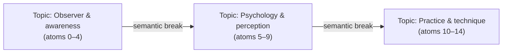

Chunks that track *ideas*, not byte offsets.

> **What is an "atom"?**
> An atom is our smallest indivisible unit of text—typically a single complete sentence or a discrete speech utterance. By operating on whole atoms, we ensure a sentence is never chopped in half.
> 
> For example, in the bilingual transcript above:
> - **Atom 0:** `"Iska matlab hai, the observer and the observed are not two things."`
> - **Atom 1:** `"Jab tum sach mein dekh rahe ho, toh observer hi observation ban jata hai."`
> 
> No matter the chunk size limits, these atoms remain fully intact. They may be grouped together or separated at a semantic boundary, but they will never be split down the middle.

---


## 2. Architecture

To keep the core chunking algorithm isolated and testable without a database or GPU, you can use a strict four-layer architecture for your components:

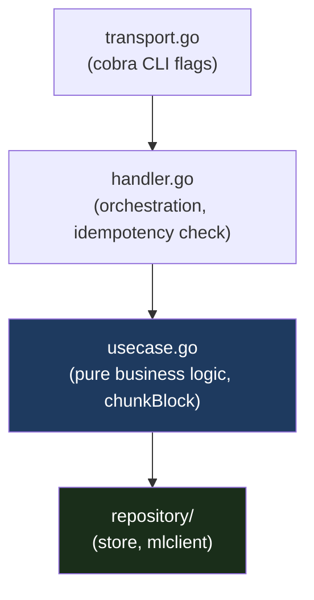

By keeping the pure business logic in the `usecase` layer, the semantic chunking algorithm can be tested independently of Postgres or the embedding model.

---

## 3. The Algorithm: Four Steps to Semantic Cuts

Here is the full chunking flow for one text block:

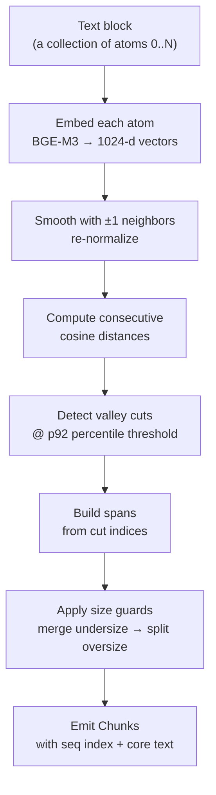

### Step 1: Embed Every Atom

Each **atom** (a single sentence or distinct utterance) is embedded via **BGE-M3**, a multilingual 1024-dimensional dense encoder that handles Hindi, English, and Hinglish in the same vector space.

```go
// usecase.go
vecs, err := u.embed.Embed(ctx, texts, true) // normalize=true → unit vectors
```

BGE-M3 is called via a **Python FastAPI sidecar** (the `pyworker`). Go owns all orchestration and logic; Python is confined strictly to GPU-bound inference. The HTTP contract is minimal: a list of strings in, a list of float32 slices out.

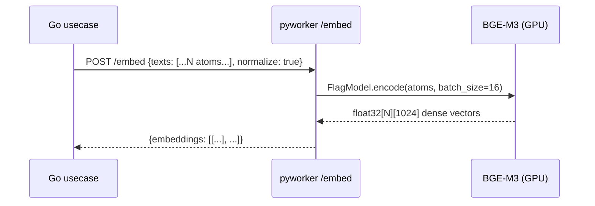

The sidecar uses **double-checked locking** to load BGE-M3 once and reuse across requests:

```python
# models.py
def get_bge():
    global _bge_model
    if _bge_model is None:
        with _lock:
            if _bge_model is None:
                from FlagEmbedding import BGEM3FlagModel
                _bge_model = BGEM3FlagModel(settings.bge_model, use_fp16=settings.use_fp16)
    return _bge_model
```

---

### Step 2: Smooth with Neighbors

Raw per-sentence embeddings are noisy. A single noisy or off-topic sentence can spike a distance value falsely. 

> **Why smooth?** 
> When people speak naturally, they often throw in brief, off-topic fillers (e.g., *"Hold on, let me take a sip of water"*). If we don't smooth the vectors, this single sentence creates a massive distance "spike," tricking the algorithm into cutting the chunk in half. By averaging it with its neighbors, we pull that outlier back toward the main topic and prevent a false cut.

We reduce this noise by replacing each atom's vector with the **mean of itself and its ±1 neighbors**, then re-normalizing to unit length:

```go
// boundary.go
func SmoothNeighbors(vecs [][]float32) [][]float32 {
    // for each atom i: average vecs[i-1], vecs[i], vecs[i+1]
    // then L2-normalize the mean
}
```

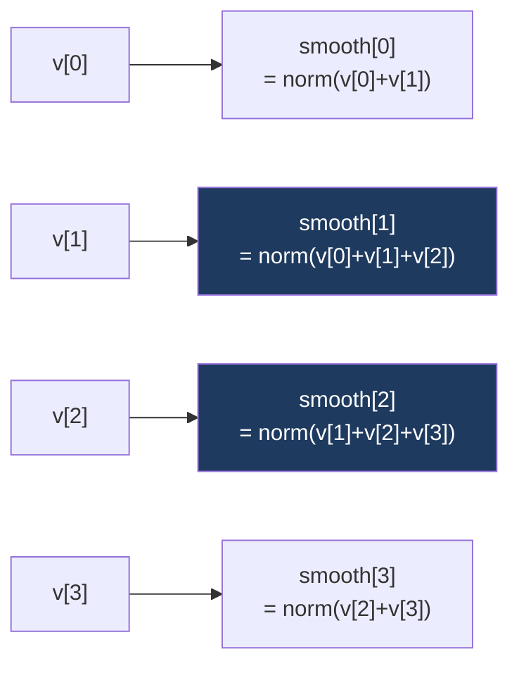

Edge atoms (first and last) only have two neighbors to average. Boundary handling is automatic because we skip out-of-range indices.

---

### Step 3: Compute the Distance Curve

With smoothed, unit-norm vectors, we compute cosine distance between each pair of **consecutive** atoms:

```
distance[i] = 1 - cosine_similarity(smooth[i], smooth[i+1])
```

For unit vectors, cosine distance is simply `1 - dot(a, b)`, which is cheap and numerically clean.

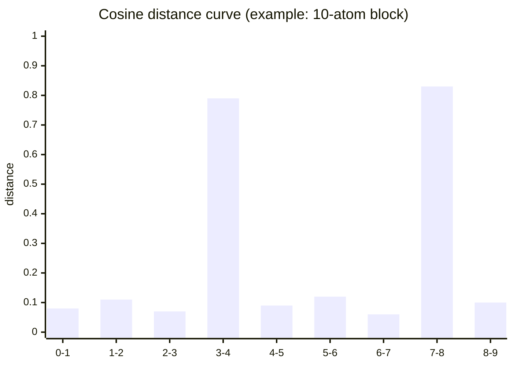

The tall bars at positions `3→4` and `7→8` are where the topic shifts. Everything else is intra-topic variation.

---

### Step 4: Cut at the Valleys

Instead of a fixed absolute threshold, we use a **per-file percentile**:

```go
// boundary.go
func DetectValleyCuts(distances []float64, percentile float64) []int {
    threshold := Percentile(distances, percentile) // e.g. p92
    var cuts []int
    for i, d := range distances {
        if d >= threshold {
            cuts = append(cuts, i)
        }
    }
    return cuts
}
```

Why percentile instead of absolute threshold?

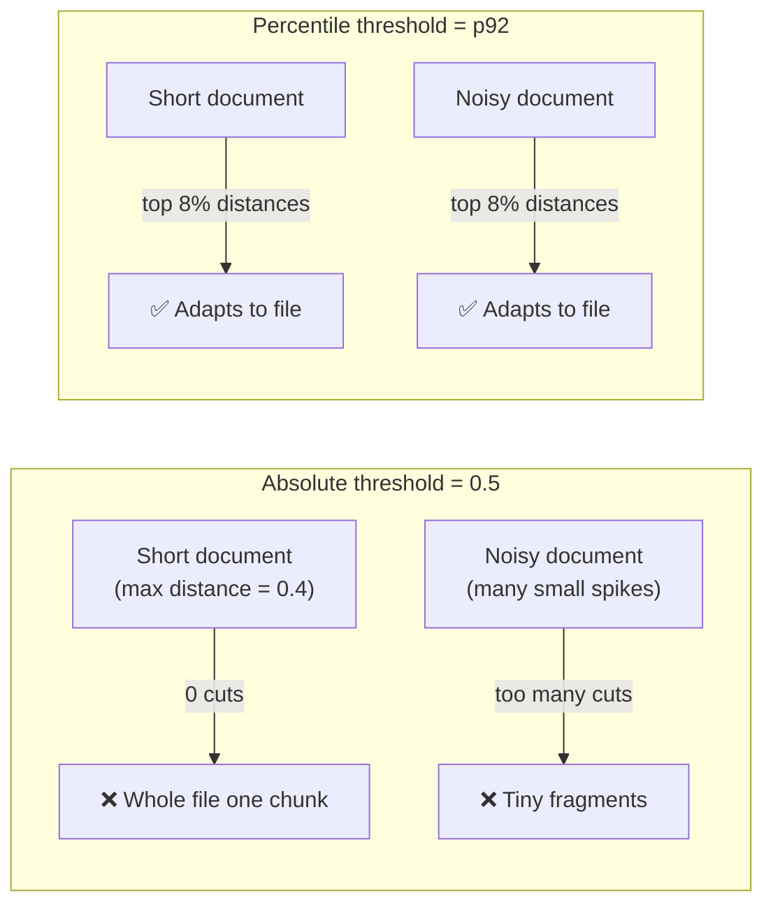

With `valley_percentile: 0.92` (from `config.yaml`), exactly the top 8% of cosine-distance values in a given block become cut points. A shorter, lower-variance block naturally gets fewer cuts; a longer, denser block gets more cuts automatically, without any per-file tuning.

---

## 4. Size Guards

Valley detection proposes cuts. Size guards **correct** them. The two-pass precedence rule is: **merge undersize first, then split oversize**. This ordering matters because you never want to split something you are about to merge.

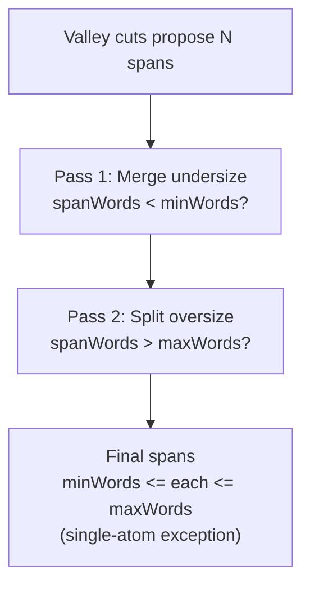

### Merge: pick the more-similar neighbor

An undersize span always merges toward the neighbor it is **semantically closer to**, meaning the side with the smaller cosine distance at the seam:

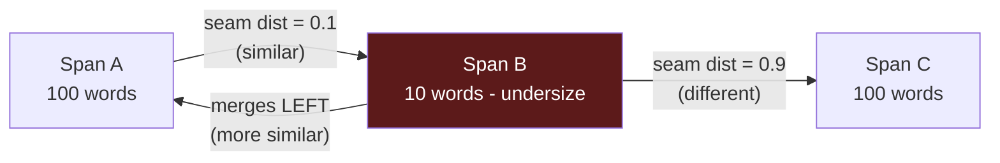

This is semantics-aware merging. Even when forced to merge, the algorithm respects the content.

### Split: find the deepest internal valley

When a span is too large, we split at the **strongest internal valley** within a sensible size band. If no valley exists in the band, we fall back to the target word count:

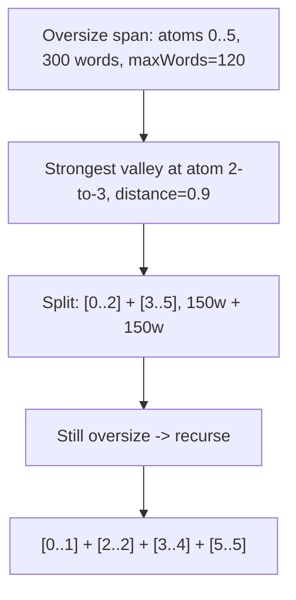

The documented **whole-sentence exception**: a single atom (one sentence) that exceeds `maxWords` is returned as-is. It cannot be split further without breaking sentence integrity.

### Config snapshot

```yaml
# config.example.yaml
chunk_configs:
  default:
    target_words: 135
    min_words:    40
    max_words:    475
    valley_percentile: 0.92
  small:                       # for parameter sweeps
    target_words: 90
    min_words:    30
    max_words:    350
    valley_percentile: 0.90
```

Multiple `chunk_config` values coexist in the database under the same source text. You can run a parameter sweep (default vs. small) without re-embedding the source, since the per-sentence embeddings are stable; only the chunking groupings change.

---

## 5. The Infra Layer

### Idempotent stages

Each stage is independently re-runnable. The contract for the `chunk` stage: **delete existing chunks for this `(file_id, chunk_config)` pair, then regenerate**. Source text segments are never touched.

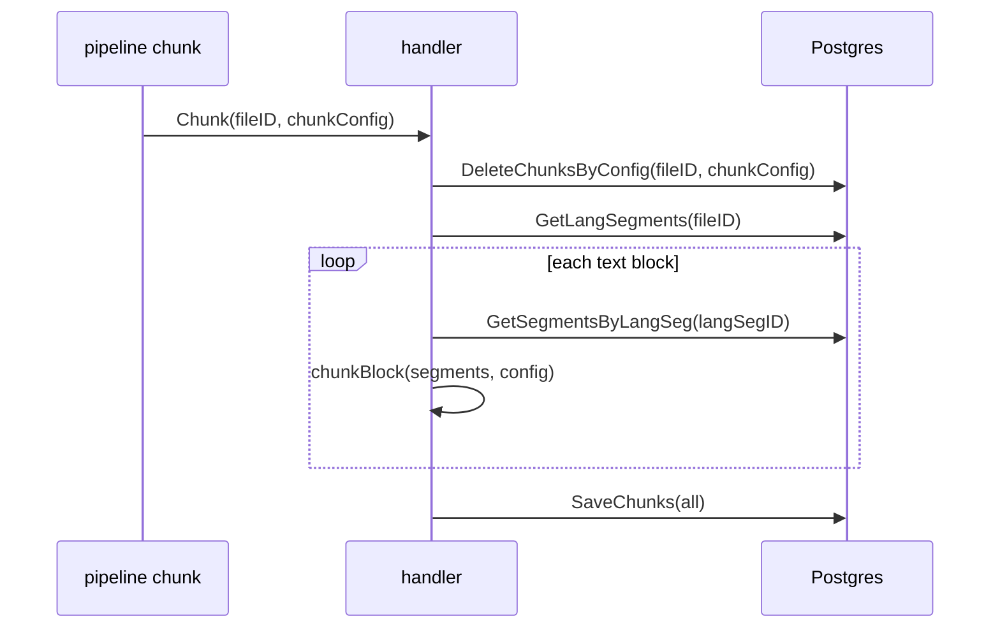

Re-running the same command is safe. Changing `chunk_config` parameters re-generates only the chunks, not the source segments.

### pgvector schema: halfvec for two models

The `chunks` table stores **two embedding columns** side by side:

```sql
-- migrations/0001_init.sql (simplified)
CREATE TABLE chunks (
    chunk_id       BIGSERIAL PRIMARY KEY,
    file_id        TEXT       NOT NULL REFERENCES files(file_id),
    lang_seg_id    BIGINT     NOT NULL REFERENCES language_segments(lang_seg_id),
    language       TEXT       NOT NULL,          -- 'hi' | 'en'
    seq_index      INT        NOT NULL,
    start_time     FLOAT8     NOT NULL,
    end_time       FLOAT8     NOT NULL,
    core_text      TEXT       NOT NULL,
    word_count     INT        NOT NULL,
    chunk_config   TEXT       NOT NULL,

    bge_vec        halfvec(1024),   -- BGE-M3 dense, L2-normalized
    gemini_vec     halfvec(3072)    -- gemini-embedding-001, L2-normalized
);

CREATE INDEX chunks_bge_hnsw    ON chunks USING hnsw (bge_vec    halfvec_ip_ops);
CREATE INDEX chunks_gemini_hnsw ON chunks USING hnsw (gemini_vec halfvec_ip_ops);
```

`halfvec` (16-bit float) instead of `vector` (32-bit) halves storage and index size with negligible precision loss for normalized retrieval. `halfvec_ip_ops` (inner product) is equivalent to cosine similarity when vectors are L2-normalized — which both BGE-M3 and Gemini vectors are enforced to be before write.

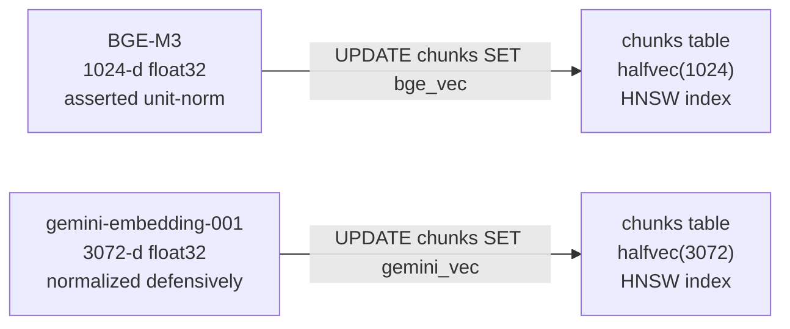

### Embedding provenance

Every embedding run writes a row to `embedding_runs` to let you trace which model version produced which vectors:

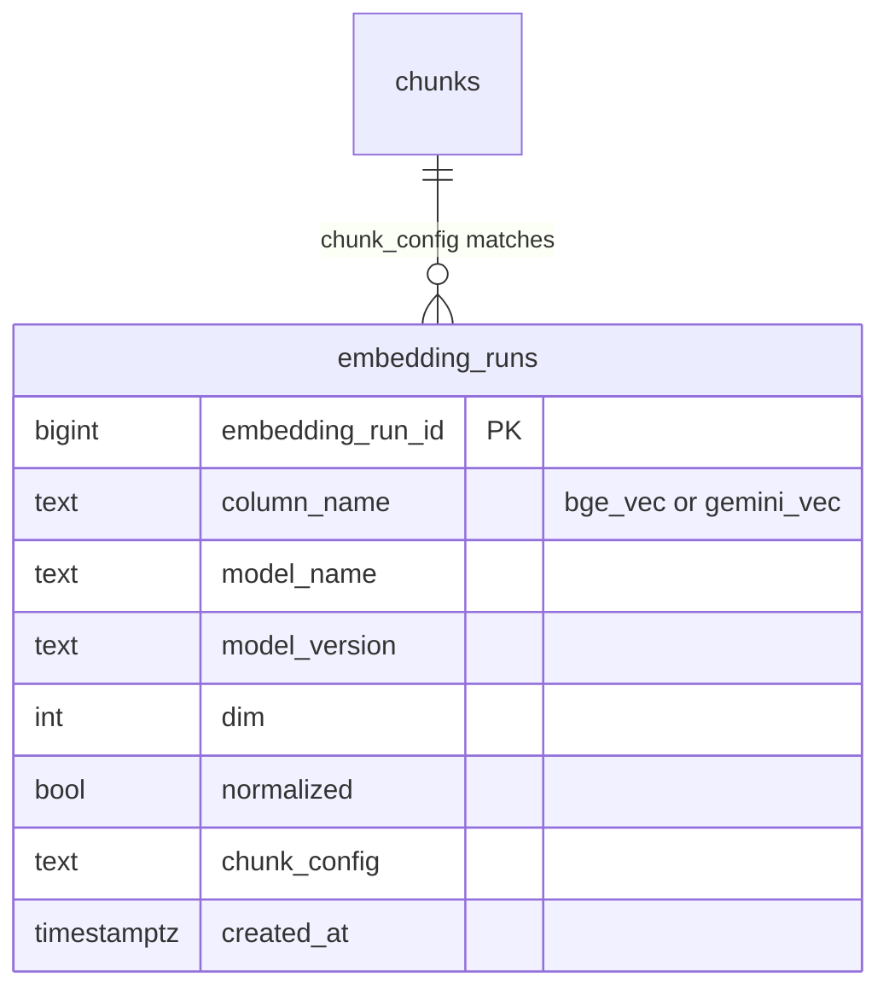

---

## 6. The Go + Python Boundary

The architecture is deliberately asymmetric:

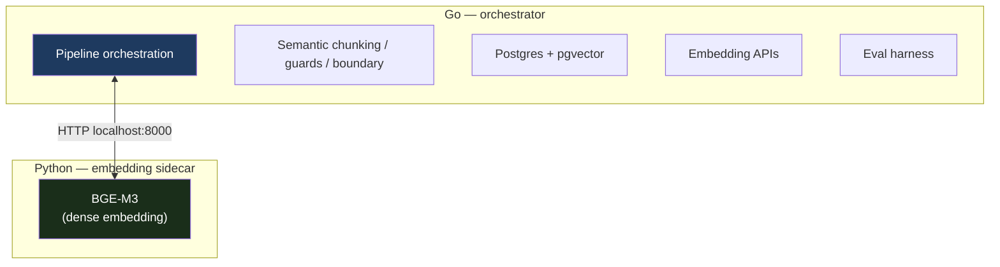

**Why this split?**

- Go is fast, statically typed, and deploys as a single binary
- Python is where the GPU model ecosystem lives; BGE-M3 requires PyTorch and FlagEmbedding
- The HTTP boundary is narrow and typed: a list of strings in, a list of float32 slices out
- **Stub mode** (`PYWORKER_STUB=1`): Python returns deterministic unit-norm vectors, so the full chunking pipeline runs end-to-end on a laptop with zero GPU

---

## 7. Testing Pure Logic Without Mocks

By designing your core algorithm (valley detection and size guards) as **pure logic** with no I/O or database dependencies, testing becomes incredibly easy. You don't need mocks, test databases, or running API workers. You just pass in arrays of numbers and assert the exact output.

For example, testing the valley detection logic is as simple as:

```go
// boundary_test.go
func TestDetectValleyCuts(t *testing.T) {
    // One clear spike at index 2.
    distances := []float64{0.1, 0.1, 0.9, 0.1, 0.1}
    cuts := DetectValleyCuts(distances, 0.9)
    if len(cuts) != 1 || cuts[0] != 2 {
        t.Fatalf("cuts=%v want [2]", cuts)
    }
}

// guards_test.go
func TestApplySizeGuards_MergeDirectionMoreSimilar(t *testing.T) {
    // Middle span undersize; left seam (0.1) more similar than right (0.9)
    // → must merge LEFT
    atomWords := []int{100, 10, 100}
    spans     := []Span{{0, 0}, {1, 1}, {2, 2}}
    distances := []float64{0.1, 0.9}
    out := ApplySizeGuards(spans, atomWords, distances,
        SizeGuards{MinWords: 40, TargetWords: 120, MaxWords: 500})
    // expect: [{0,1}, {2,2}]
}
```

When building your own system, you can easily create a comprehensive test suite to cover all edge cases without any complex setup:

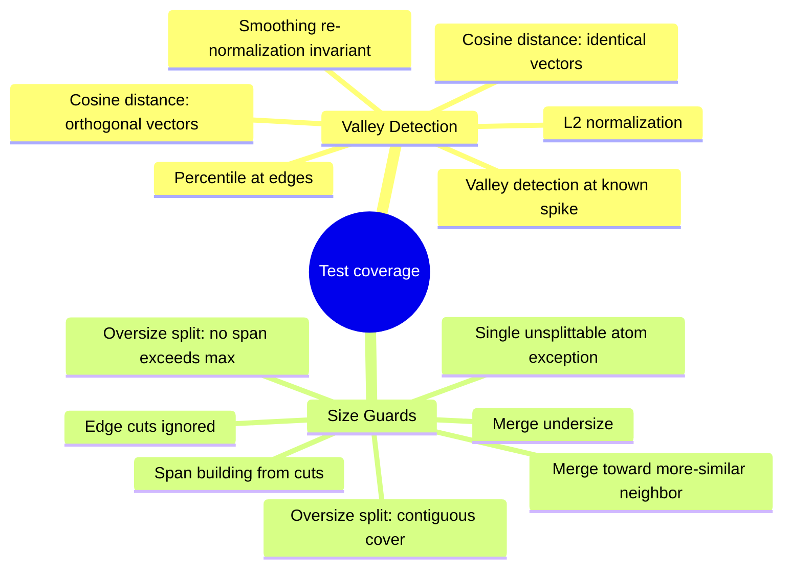

This ensures your chunking logic is perfectly reliable before it ever touches a real database or embedding model.

---

## 8. Summary

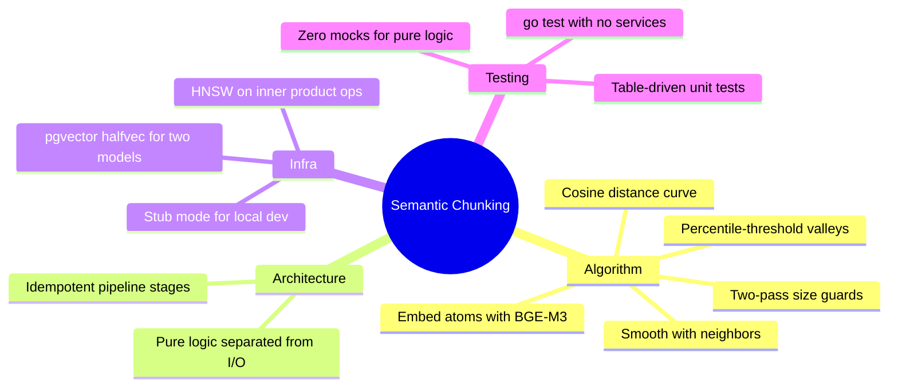

1. **Percentile thresholding beats absolute thresholds.** Your threshold adapts to each file's variance distribution automatically without per-file tuning.

2. **Smooth before computing distances.** A single noisy sentence creates a false spike; ±1 neighbor averaging removes most of them cheaply.

3. **Merge before split in size guards.** Merging can create an oversize span — which is then handled. The reverse causes subtler bugs.

4. **Pure-logic separation is not just an architecture virtue.** Your most complex algorithm becomes testable in five lines, portable, and auditable without any framework dependency.

5. **`halfvec` in pgvector** is the right default for normalized vectors: halved storage, identical retrieval semantics (inner product equals cosine for unit vectors), HNSW indexable on vectors that would otherwise be too wide.

6. **Design stub mode in from day one.** A Python embedding sidecar with a stub fallback (`PYWORKER_STUB=1`) makes local development as fast as any pure-Go project. Do not bolt it on later.

