> *Premature optimization in vector storage is a silent bug. It doesn't crash. It just quietly makes your AI dumber, and you won't notice until a user does.*

---

## Table of Contents

1. [The Problem: The Storage Dilemma](#1-the-problem-the-storage-dilemma)
2. [The Three Paths at a Glance](#2-the-three-paths-at-a-glance)
3. [Path 1: No Optimization](#3-path-1-no-optimization)
4. [Path 2: Matryoshka Truncation](#4-path-2-matryoshka-truncation)
5. [Path 3: halfvec Quantization](#5-path-3-halfvec-quantization)
6. [Side-by-Side Comparison](#6-side-by-side-comparison)
7. [What It Actually Costs: RAM and Cloud Pricing](#7-what-it-actually-costs-ram-and-cloud-pricing)
8. [The Decision Framework](#8-the-decision-framework)
9. [The Domain Nuance Problem](#9-the-domain-nuance-problem)
10. [What Silent Degradation Actually Looks Like](#10-what-silent-degradation-actually-looks-like)
11. [Prove It: The Gold Standard Eval Loop](#11-prove-it-the-gold-standard-eval-loop)

---

## 1. The Problem: The Storage Dilemma

Here's the thing about modern embedding models: they're heavy.

- `gemini-embedding-002` puts out **3,072 dimensions** per chunk
- `BGE-M3` puts out **1,024 dimensions** per chunk
- `text-embedding-3-large` is also **3,072 dimensions**

Each dimension is a 32-bit float, 4 bytes. Scale that to 10 million chunks and the numbers get uncomfortable fast:

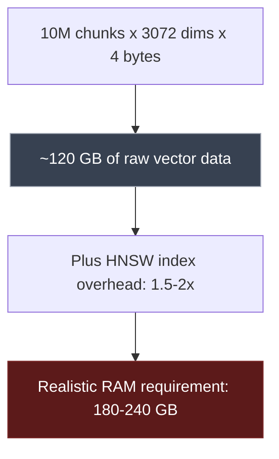

At that scale, the instinct to optimize is fair. The danger is optimizing without knowing what you're actually giving up.

---

## 2. The Three Paths at a Glance

There are three choices. Exactly three. Every "optimization strategy" you'll read about is one of these.

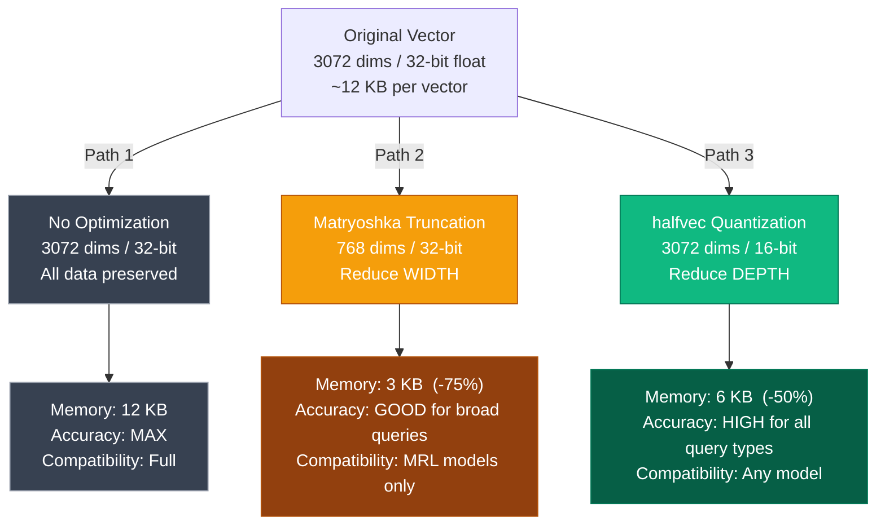

Each one has a legitimate place. The mistake is picking one by default, without checking if the tradeoff actually fits your situation.

---

## 3. Path 1: No Optimization

Choosing not to optimize is a real architectural decision. It's not laziness. Sometimes it's the right call. But two things can independently force you off it — dataset size, and your vector DB's own constraints.

### The math

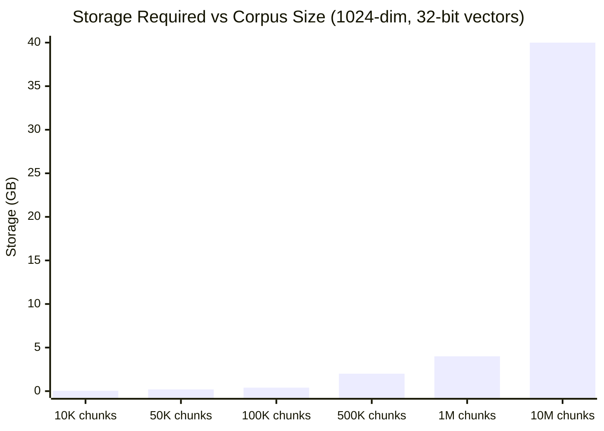

100,000 chunks, roughly a corpus of 500 books, costs **400 MB** unoptimized. That fits in a `db.t3.medium`. Memory alone isn't a reason to optimize until you're well past 1M chunks.

### Two things that force your hand

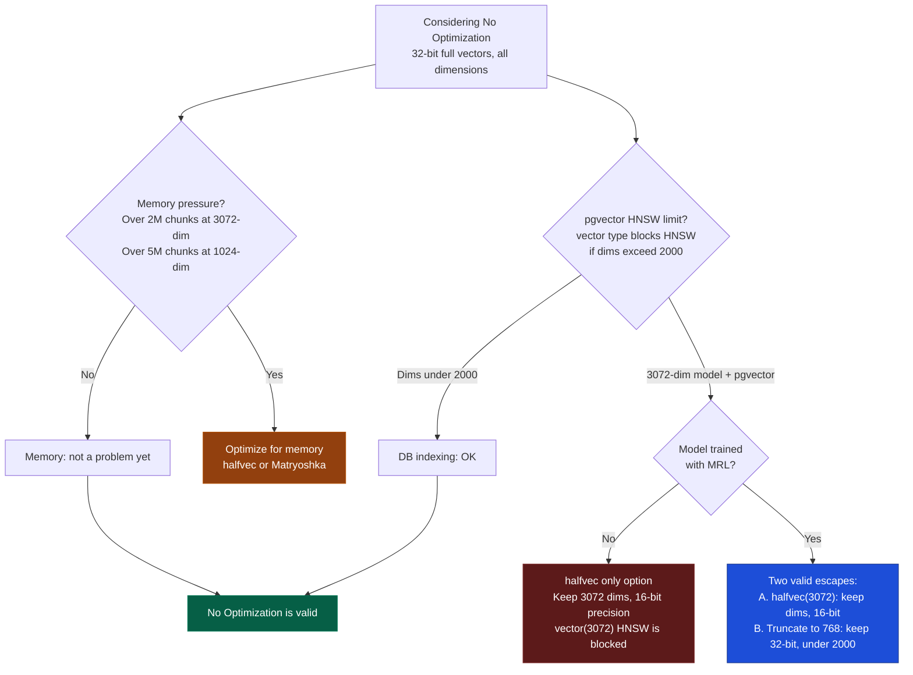

When you hit the pgvector HNSW wall with a 3,072-dim model, you actually have two exits depending on whether your model supports MRL:

- **`halfvec` (always available):** keep all 3,072 dimensions, drop float precision to 16-bit. The vector shape is intact, just less decimal resolution. Works with any model.
- **Matryoshka truncation to under 2,000 dims (MRL models only):** keep full 32-bit floats, but trim dimensions down to e.g. 768. Now you're back under the HNSW limit with no precision loss at all. Only valid for `gemini-embedding-002` or OpenAI's `text-embedding-3` family.

So the HNSW block isn't a "use halfvec, end of story." It's a forcing function that eliminates "do nothing," but it still leaves you a choice between losing depth (halfvec) or losing width (Matryoshka) — the same tradeoff from sections 4 and 5, just now driven by the DB constraint rather than memory.


### When to use it

- Under 1M chunks with no hard RAM budget
- Your embedding dimension is under 2,000, or you're on a DB without the HNSW dim cap
- Retrieval quality is the primary metric
- You want nothing extra to debug

### My rule

> If you don't have a real constraint, don't manufacture one. But check your DB's dimension limits before assuming you have none.

---


## 4. Path 2: Matryoshka Truncation

Matryoshka Representation Learning (MRL) is a training technique where the model packs its most important, broadest semantic concepts into the **earliest dimensions**, and pushes fine-grained nuance toward the **later dimensions**.

Think of it like a Russian nesting doll. The first doll gives you the rough shape. The inner dolls add detail.


Because the dimensions are sorted by importance, you can literally cut off the tail end. Truncating 3,072 to 768 dimensions saves **75% on storage and index size**, with acceptable accuracy loss for broad queries.

### The thing most people miss

This only works if the model was trained with MRL. Apply truncation to a model that wasn't, and you're randomly deleting 25% of its semantic representation. Accuracy will collapse, and it won't be obvious why.

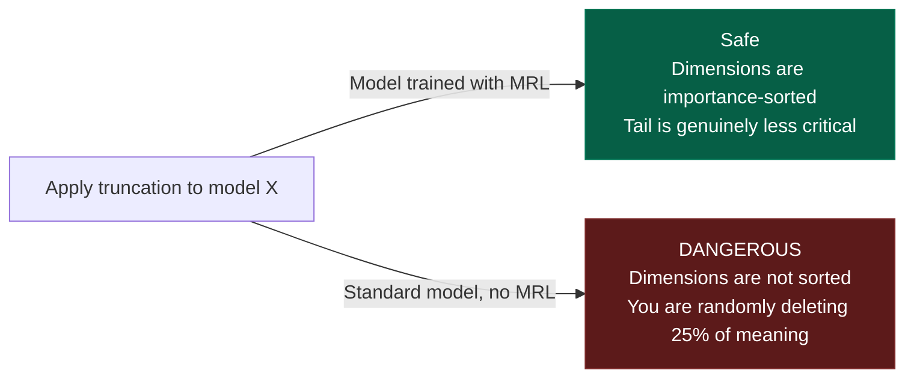

**Models that support MRL:**
- `gemini-embedding-002` (truncate to 768, 512, 256, or 128)
- `text-embedding-3-small` and `text-embedding-3-large` (OpenAI)

**Models that don't. Don't truncate these:**
- `BGE-M3`
- `E5-mistral-7b`
- Most Sentence-Transformers pre-2024

### When to use it

- 10M+ vectors with a tight RAM budget
- Your model explicitly documents MRL support
- Queries are broad topic-level retrieval, not fine-grained distinctions
- You've run an eval to confirm accuracy holds before deploying

---

## 5. Path 3: halfvec Quantization

This one is simpler to reason about. Instead of cutting dimensions, we keep all of them and just lower the precision of each number. A 32-bit float like `0.12345678` becomes a 16-bit float like `0.1234`. Same shape, less storage.

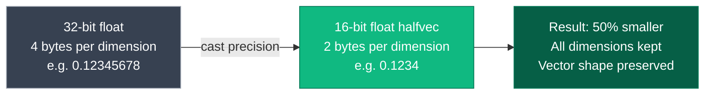

`pgvector` ships this as a native column type: `halfvec`. Full HNSW indexing, up to 4,000 dimensions.

### The constraint that surprises people

Here's something I didn't know until I hit it: `pgvector`'s standard `vector` type has a hard limit on HNSW indexes.

```postgres frame="code" title="schema.sql"
-- Standard vector: HNSW fails at > 2000 dims
CREATE INDEX ON chunks USING hnsw (gemini_vec vector_ip_ops);  -- ERROR

-- halfvec: HNSW works at any supported dimension
CREATE INDEX ON chunks USING hnsw (gemini_vec halfvec_ip_ops); -- Works
```

If you're using `gemini-embedding-002` (3,072 dims) with a plain `vector` column, you can't build an HNSW index at all. Every query falls back to a sequential scan. `halfvec` isn't optional here. It's the only path that works.

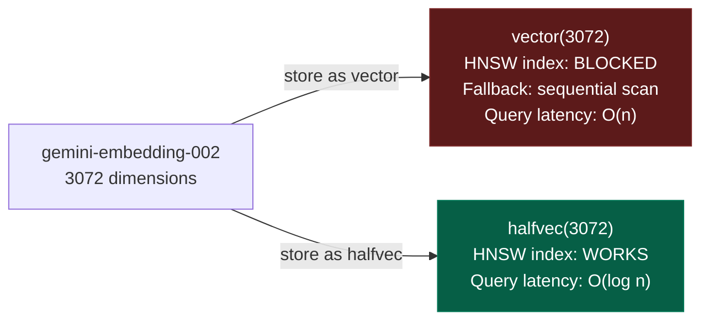

### When to use it

- Any model without MRL support that still needs memory reduction
- Any 3,072-dim model with `pgvector` (the HNSW constraint forces it)
- Domains where deep semantic nuance matters: legal, philosophical, medical
- When you want the full vector shape but can accept a small precision drop

---

## 6. Side-by-Side Comparison

| Property | No Optimization | Matryoshka Truncation | halfvec Quantization |
|---|---|---|---|
| Memory saving | 0% | Up to 75% | 50% |
| Accuracy impact | None | Low to High (domain-dependent) | Negligible |
| Works with any model | Yes | No, MRL-only | Yes |
| pgvector HNSW on 3072-dim | Blocked | Yes (dims reduced) | Yes |
| Preserves all dimensions | Yes | No | Yes |
| Good for broad queries | Yes | Yes | Yes |
| Good for nuanced queries | Yes | No | Yes |
| Complexity added | None | Low | Low |

---

## 7. What It Actually Costs: RAM and Cloud Pricing

Knowing which strategy to pick is one thing. Knowing what you're paying for each option is what makes the argument in a planning doc or a cloud budget review.

The formula is the same regardless of strategy:

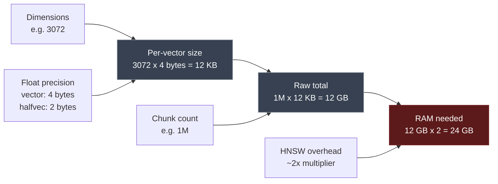

The HNSW index roughly doubles your raw vector storage in RAM. It has to — the graph structure that makes approximate nearest-neighbour search fast needs to live in memory too.

### How strategy changes your RAM at the same corpus size

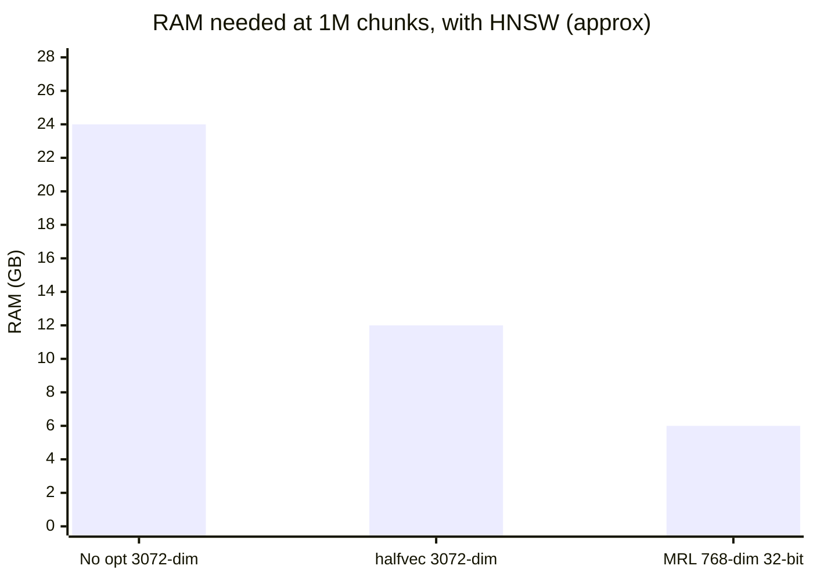

| Strategy | Per vector | 1M chunks raw | With HNSW (~2x) | Saving vs baseline |
|---|---|---|---|---|
| No opt (3072-dim, 32-bit) | 12 KB | 12 GB | ~24 GB | baseline |
| halfvec (3072-dim, 16-bit) | 6 KB | 6 GB | ~12 GB | 50% |
| MRL truncated (768-dim, 32-bit) | 3 KB | 3 GB | ~6 GB | 75% |

### What that RAM requirement means in cloud dollars

For managed PostgreSQL with pgvector (AWS RDS, GCP Cloud SQL), the instance must hold the full HNSW index in RAM. If it can't, queries fall back to disk. The instance tier is the cost you're committing to.

| RAM needed | AWS RDS instance | ~Monthly | GCP Cloud SQL instance | ~Monthly |
|---|---|---|---|---|
| Up to 8 GB | db.r6g.large (16 GB) | $190 | db-highmem-2 (13 GB) | $130 |
| Up to 16 GB | db.r6g.large (16 GB) | $190 | db-highmem-4 (26 GB) | $250 |
| Up to 32 GB | db.r6g.xlarge (32 GB) | $380 | db-highmem-4 (26 GB) | $250 |
| Up to 64 GB | db.r6g.2xlarge (64 GB) | $760 | db-highmem-8 (52 GB) | $500 |
| Up to 128 GB | db.r6g.4xlarge (128 GB) | $1,520 | db-highmem-16 (104 GB) | $1,000 |
| Up to 256 GB | db.r6g.8xlarge (256 GB) | $3,040 | db-highmem-32 (208 GB) | $2,000 |

*Approximate on-demand rates, us-east-1 / us-central1. Reserved instances cut this 30-40%.*

To make it concrete: **1M chunks at 3,072-dim with no optimization needs ~24 GB, which lands you on a ~$380/month AWS instance.** Switch to `halfvec` and the same corpus fits on the $190/month tier. Switch to Matryoshka at 768 dims and it fits comfortably within 8 GB — the cheapest tier available.

That's the real cost of the choice. Not just bytes saved, but the billing tier your database has to live on.

---

## 8. The Decision Framework

Here's the tree I walk through when I'm making this call for any new system.

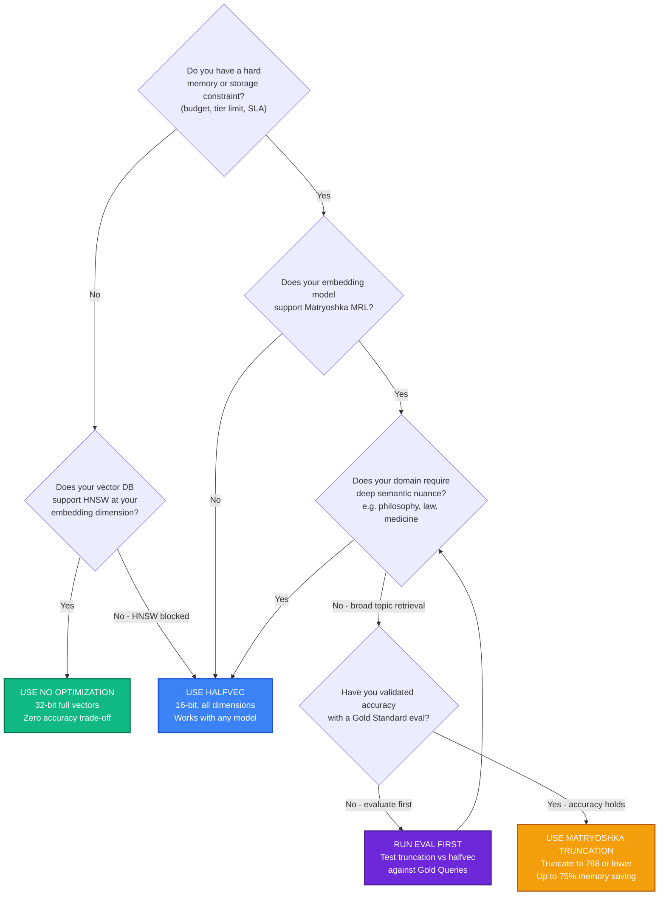

Two things worth highlighting:

**The eval step is in the tree on purpose.** You shouldn't reach "use Matryoshka" without running a validation pass first. That's the difference between a decision and a guess.

**The pgvector HNSW limit catches people off-guard.** If you pick `gemini-embedding-002` and skip this check, you'll be doing sequential scans in production and wondering why queries are slow.

---

## 9. The Domain Nuance Problem

This is the variable I see underestimated most often, and it's the one that actually hurts people in production.

The same optimization that's perfectly safe for an e-commerce product catalog will quietly destroy retrieval quality for a specialized knowledge corpus. Here's why:

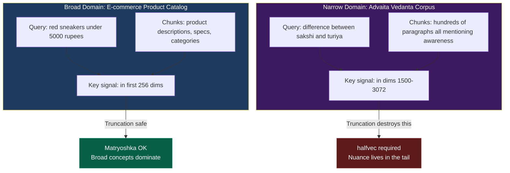

In a narrow domain like the Vedanta corpus above, Matryoshka groups all paragraphs about "awareness" tightly together in the first 768 dimensions. A query about a specific philosophical distinction will pull back whichever paragraph has the most surface-level overlap with the query text, not the semantically correct one.

This isn't an accuracy problem. It's a precision problem. Recall stays high; the system retrieves *something* that looks relevant. Precision collapses; it's just the wrong thing.

---

## 10. What Silent Degradation Actually Looks Like

Most teams don't catch vector optimization errors before production. Here's the actual pattern:

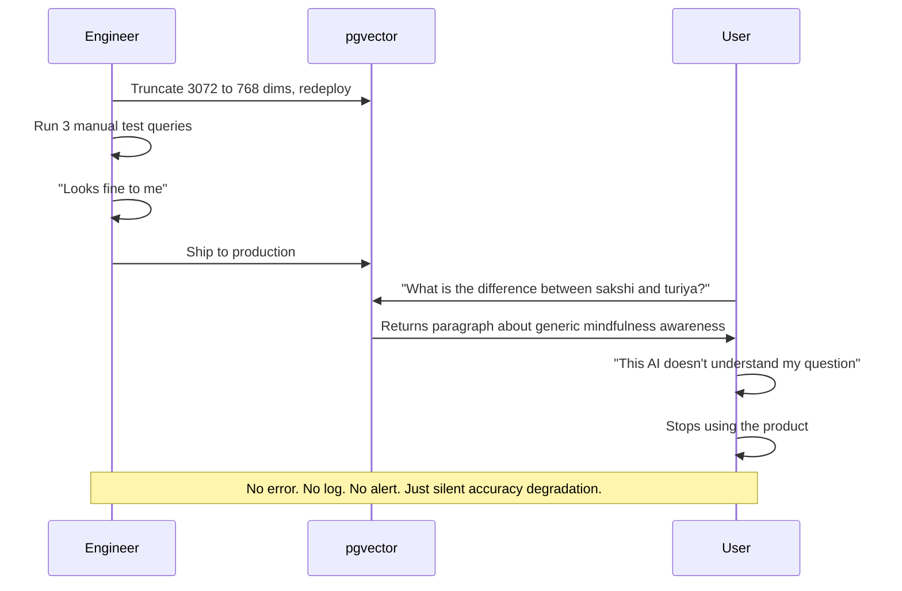

The problem with "run a few queries and check" is that you're testing with broad queries. Those are exactly the queries where truncation works fine. The nuanced ones that break are the ones you didn't think to test.

---

## 11. Prove It: The Gold Standard Eval Loop

Before shipping any optimization, you need one thing: a number. Not a vibe. A measurement that tells you whether the tradeoff is acceptable.

Build this directly into your database schema.

### The schema

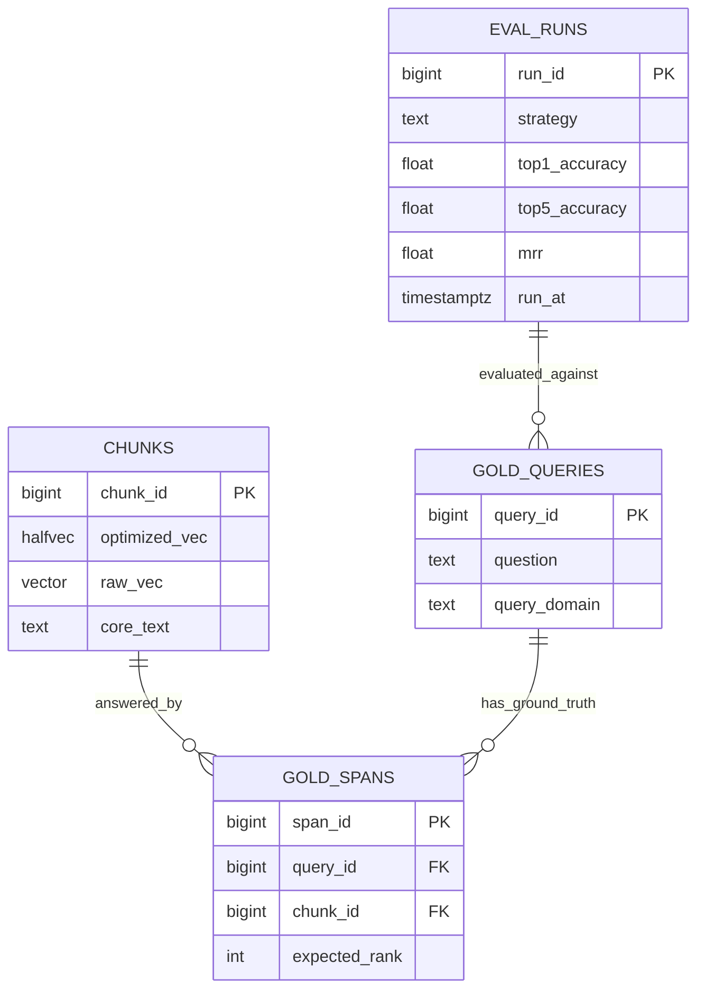

### The eval workflow

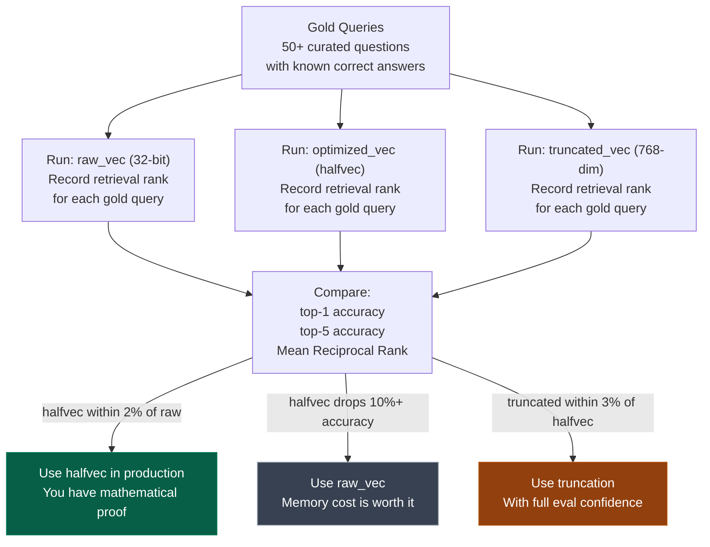

### What your gold queries need to look like

- **Volume:** At least 50 per domain. 200+ if your corpus is specialized.
- **Coverage:** Mix broad queries ("What is mindfulness?") with precise ones ("What distinguishes turiya from deep sleep in Kashmir Shaivism?"). The precise ones are what expose truncation failures.
- **Ground truth:** Not "probably this chunk." The exact chunk ID, verified by someone who actually knows the domain.

### The decision gate

If truncating drops your top-5 retrieval accuracy from 95% to 60%, the evidence is sitting right in your database. The memory savings aren't worth the lobotomy. But if `halfvec` matches raw accuracy within 2%, you have proof the optimization is free. Take it.

The eval loop turns an architectural guess into a decision you can stand behind.

---

Optimize wisely, measure precisely. Sometimes the best algorithm is no algorithm at all.
